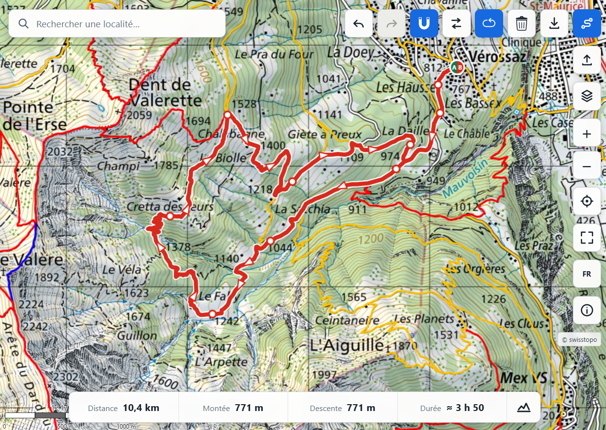

# Via Helvetica

[](https://github.com/egofree71/via-helvetica/actions/workflows/deploy.yml)
[](LICENSE)

Via Helvetica is a free, open-source web application for planning hiking
routes in Switzerland with official swisstopo maps and geodata. It stays
focused on one route at a time. Core planning and normal GPX export run entirely
in the browser; an optional tiny Cloudflare Worker can host a GPX temporarily
when the user explicitly asks to transfer it to the swisstopo app from a
larger-screen layout. The hand-off is presented as a QR code; phone-width
layouts keep the normal local GPX export only.

Built with React, TypeScript, Vite, OpenLayers, and Vitest.

**Live application:** [viahelvetica.ch](https://viahelvetica.ch/)



## Table of contents

- [Features](#features)
- [Project principles](#project-principles)
- [Quick start](#quick-start)
- [Offline routing-data generation](#offline-routing-data-generation)
- [Basic usage](#basic-usage)
- [Data sources](#data-sources)
- [Known limitations](#known-limitations)
- [Documentation](#documentation)
- [Regression tests](#regression-tests)
- [Production build and deployment](#production-build-and-deployment)
- [Contributing](#contributing)
- [License](#license)

## Features

| Area | Highlights |
|---|---|
| Map | Full-screen OpenLayers map in native Swiss LV95 (`EPSG:2056`), with official swisstopo color, grey, and aerial backgrounds, hiking trails, optional clickable SwitzerlandMobility hiking routes, persistent visibility and opacity controls for information layers, place and WGS 84/LV95 coordinate search, desktop right-click coordinate/elevation inspection, geolocation, scale, and fullscreen mode |
| Route planning | Editable ordered waypoints, start and finish markers, sparse direction arrows, optional swissTLM3D snapping in a dedicated routing Worker, undo, redo, reversal, loop closure, route deletion, and straight fallback segments when no routable path is found |
| Route information | Distance, ascent, descent, Swiss hiking-time estimate, and a collapsible elevation profile with pointer synchronisation between the chart and the map |
| Import and export | Read-only GPX loading with route statistics and elevation profile, optional lossless conversion of one continuous GPX trace into editable waypoints without rerouting the initial geometry, named GPX export for editable, imported, and selected SwitzerlandMobility routes, plus an optional swisstopo hand-off that temporarily exposes the current GPX and presents a QR code on larger-screen layouts; phone-width layouts keep local GPX export only |
| Safety | Official hiking-trail closures and detours, plus military shooting notices and danger zones with localized details |
| Public transport | Passenger-relevant stops, mode-specific symbols, next departures grouped by date, and links to the official SBB/CFF/FFS timetable |
| Interface | Compact floating controls, no permanent toolbar, French, German, Italian, and English translations with shareable localized URLs, a one-time release-highlights dialog, and localized About and static release-history pages |

## Project principles

Via Helvetica deliberately keeps route planning in the browser. Users do not
need to register, routes are not persistently stored by the project, and static
hosting keeps recurring operating costs as low as possible. Normal GPX download
remains local. If the optional swisstopo hand-off is configured, the current
named GPX is uploaded only after an explicit user action, receives an unguessable
temporary URL, and is deleted after 24 hours by default. The browser otherwise stores only
interface preferences and release acknowledgements. External official services
still receive the bounded requests required for maps, geodata, elevation,
routing fallback, and departures.

The router is an interactive planning aid rather than an autonomous navigation
system. The official hiking portrayal remains visible on the map, and users can
add a closer waypoint whenever parallel paths or a complex junction make their
intent ambiguous.

## Quick start

Vite 8 requires Node.js 20.19 or later, or Node.js 22.12 or later. A recent
LTS release is recommended.

```bash
node --version
npm --version
npm install
npm run dev
```

Vite then displays the project address, usually:

```text
http://localhost:5173/
```

No local routing-data configuration is required for a normal development start:
GeoAdmin remains available as a fallback. To test the published precomputed
routing dataset locally, set `VITE_ROUTING_DATA_BASE_URL` in `.env.local`; see
[Offline routing-data generation](#offline-routing-data-generation). To test the
optional swisstopo hand-off, deploy the Worker example below
`workers/swisstopo-gpx-share/` and set `VITE_SWISSTOPO_SHARE_SERVICE_URL` to its
public HTTPS origin. Without that variable the extra action stays hidden.
For production, pair the dedicated GPX bucket with a one-day R2 lifecycle
deletion rule and enable the example Worker rate-limiting binding for `POST /gpx`;
the CORS allow-list is a browser policy, not an authentication mechanism.

## Offline routing-data generation

National swissTLM3D sources, geometry cells, SQLite work files, and binary
releases live outside the repository. Copy
`routing-data.config.example.json` to the git-ignored
`routing-data.config.local.json`, then set one dataset identifier, one binary
format identifier, the scope, the external data root, and the source GeoPackage.
The scripts derive the local work/release paths and the versioned R2 prefix from
that release identity. Then run:

```bash
npm run generate:routing-geometry
npm run generate:precomputed-binary-routing
npm run verify:precomputed-binary-routing
```

The local release retains raw and Brotli cells for complete verification. R2
publication uploads only `.bin.br`, checksum-checks the remote objects, and
publishes `manifest.json` last. To use a published release, set
`VITE_ROUTING_DATA_BASE_URL` in `.env.local` and restart Vite.

The generic import, generation, verification, and publication workflow is
documented in [Routing data pipeline](docs/ROUTING_DATA_PIPELINE.md).
Machine-specific infrastructure and credentials remain outside version control.

## Basic usage

### Choose maps and information layers

- Use the **Layers** button to choose the background map and enable or disable
  information overlays.
- Use the search field to find an official place or paste decimal WGS 84 or
  Swiss LV95 coordinates. Recognized coordinates are handled locally without a
  search-provider request.
- Changing the interface language updates the shareable `/fr/`, `/de/`, `/it/`,
  or `/en/` URL without reloading the map or the current itinerary.
- The application uses official portrayals for map backgrounds, hiking trails,
  and the optional **Hiking SwitzerlandMobility** routes. The latter is disabled
  by default. Information layers can be shown, hidden, or made more or less
  opaque from the same menu, and explicit choices are remembered in the browser.

### Create and edit a route

- Activate route creation, then click or tap the map to place waypoints.
- Snapping is enabled by default and can be changed before the first waypoint.
  With snapping enabled, sections follow available swissTLM3D roads and paths;
  consecutive routed waypoints must remain within 15 km direct distance, so a
  longer crossing needs intermediate points that indicate the intended corridor.
  With snapping disabled, sections are created as straight lines without that
  network-routing limit.
- Drag an existing waypoint to move it, click it to delete it, or drag a route
  section to insert a new waypoint.
- Use the route controls to undo, redo, reverse, close or reopen a loop, or
  delete the current editable itinerary. Use the shared export action in the map
  controls whenever the current itinerary can be exported.
- Compact **A** and **B** markers identify the current start and finish.

### Import and export GPX

- Load a GPX file as the current purple, read-only itinerary.
- For a GPX containing one continuous segment inside the Swiss map extent, use
  the pencil action beside the statistics bar to make it editable. Conversion
  creates waypoints on existing GPX vertices and does not reroute or simplify
  the initial geometry. Editable conversion is currently limited to 20,000
  source vertices; denser files remain fully available in read-only mode.
- Long converted routes may retain hundreds of editing anchors in route state.
  At broad map scales, waypoint handles are automatically decluttered in screen
  space and direction arrows avoid only the handles that are actually visible.
- Imported GPX routes reuse embedded elevations when available, otherwise the
  profile is requested from GeoAdmin. A converted route keeps the embedded
  profile while its geometry is still pristine.
- Export the current editable route or loaded GPX as a named GPX file. The
  original GPX XML remains available after conversion while the editable state
  is still pristine, so metadata and extensions can still be preserved after
  entering edit mode. Once an edit is committed, Via Helvetica exports a generated
  GPX while retaining untouched imported section vertices.
- When the optional share Worker is configured, larger-screen layouts can use
  **Open in swisstopo** to upload that same named GPX for up to 24 hours by
  default and display a QR code for the official `swisstopo.app/u/` hand-off.
  Phone-width layouts keep the normal local GPX export only. Temporary transfer
  is limited to 2 MiB; larger GPX files remain available through local export.
- Starting a new route replaces the imported itinerary.

### Inspect route and map information

- Distance, ascent, descent, Swiss hiking-time estimate, and the elevation
  profile are shown in the bottom summary.
- When the profile is open, moving over the route or the chart mirrors the same
  position in both directions.
- Outside route-creation mode, click visible closures, danger zones, public
  transport stops, or green SwitzerlandMobility routes to inspect their available
  information. A selected public hiking route is highlighted and framed in full;
  its calculated elevation profile can be opened from the summary and remains
  synchronized with the map. Once its complete geometry is available, it replaces
  any editable route or imported GPX as the single current itinerary. The shared
  export action in the map controls downloads that selected stage as GPX. When
  several information objects share the same click—for example a transport stop
  on a SwitzerlandMobility route—choose the one to inspect from the common map
  chooser before its detailed workflow opens.
- On desktop, right-click any map position to place a temporary point and inspect
  its WGS 84 coordinates, Swiss LV95 coordinates, and terrain elevation. WGS 84
  and LV95 values can be copied directly from the compact lower-map panel.
- Use the information button to open the localized About dialog with the
  project summary, support contact, source code, license, professional profile,
  release history, and official data credits. Returning visitors are introduced
  once to each newer application version through a compact dialog that links to
  the complete history; first-time visitors go directly to the map.

The application requests browser geolocation only after the location button is
pressed. Deployed geolocation requires HTTPS.

## Data sources

Via Helvetica uses official swisstopo backgrounds and swissTLM3D geodata,
official SwitzerlandMobility hiking routes, hiking-closure and military
danger-zone layers, Federal Office of Transport stop data, GeoAdmin services,
and `transport.opendata.ch` departure data. The primary routing provider loads
precomputed swissTLM3D binary cells on demand from a published national dataset.
It starts route sections with typical-case metric envelopes and widens them only
when A* cannot certify that the loaded cells are sufficient. A complete snap
miss stops immediately, while uneconomical or still-inconclusive envelopes
return to the legacy radius-1 then radius-2 workflow. GeoAdmin remains available
as a session fallback when that dataset cannot be used.

- **swisstopo** provides the official Swiss maps and geodata.
- **swissTLM3D** is swisstopo's topographic landscape model and supplies the
  road-and-path network used for route snapping.
- **GeoAdmin** is the federal geodata platform used for maps, routing fallback,
  elevation, and map-information requests.
- **SwitzerlandMobility / ASTRA** provides the national, regional, and local
  hiking-route portrayal plus public route identity and geometry used for route
  selection. Via Helvetica calculates the displayed distance, elevation totals,
  and walking-time estimate from that geometry.
- **LV95 / EPSG:2056** is the Swiss national projected coordinate system used
  internally by the map, routing graph, and editable geometries.

Walking-time estimates apply the slope-sensitive model published by Schweizer
Wanderwege in *Wanderzeitberechnung, Version 2020.2* (8 June 2020).

For the application-wide design, see the
[architecture document](docs/ARCHITECTURE.md). Detailed routing data sources,
cell loading, graph construction, snapping, A*, caching, bounded binary-provider
retries, and session fallback are documented in
[Browser routing](docs/ROUTING.md).

## Known limitations

- Dynamic swissTLM3D routing is experimental and runs entirely in the browser.
- A route section falls back to a straight line when no routable path can be
  resolved.
- Closures and danger zones are informational and do not automatically change
  route calculation.
- Imported GPX and selected SwitzerlandMobility routes initially replace the
  previous current itinerary as read-only geometry. A GPX can be converted to an
  editable route only when it contains one continuous segment inside the map
  extent; multi-segment GPX files remain read-only in the current implementation.
- Routes are not saved as a local or remote route library. Export the current
  itinerary as GPX before leaving or reloading the application if you want to
  keep it; swisstopo hand-off objects are temporary transfer files only.
- External map, elevation, routing, and timetable services can be temporarily
  unavailable or incomplete.

## Documentation

- [Architecture](docs/ARCHITECTURE.md): product constraints, component
  boundaries, state model, main workflows, provider integration, performance,
  errors, testing, and deployment.
- [Browser routing](docs/ROUTING.md): bounded swissTLM3D loading, Worker
  protocol, cell and graph caches, hiking enrichment, snapping, A*, fallback
  semantics, tests, and validation scope.
- [Routing data pipeline](docs/ROUTING_DATA_PIPELINE.md): generic external-data
  layout, GeoPackage import, binary generation, verification, and immutable
  publication contracts.

## Regression tests

The focused Vitest suite covers immutable route transformations, route editing,
GPX parsing and export, swisstopo hand-off URL and QR generation, temporary
share validation/expiry rules, route metrics, directional-arrow placement,
location-search provider normalization, local WGS 84/LV95 coordinate parsing,
rendered-layer provider contracts, default opacity and persistence,
release acknowledgement and localized history content, passenger-stop filtering
and viewport loading, worker-client messaging, and the
dynamic routing engine's certified binary envelopes, legacy corridors, cache,
cancellation cleanup, bounded binary-provider retry, session fallback,
hiking-enrichment fallback, and straight-fallback behaviour.

Run the test suite with:

```bash
npm test
```

During development, use `npm run test:watch` to rerun affected tests after each
change. GitHub Actions runs the complete suite before building and deploying
the site.

## Production build and deployment

Build the production bundle with:

```bash
npm run build
```

The build first generates localized application entries for `/fr/`, `/de/`,
`/it/`, and `/en/`, plus static release-history pages below each language path,
then bundles them as a Vite multi-page application.

Preview it locally with:

```bash
npm run preview
```

The repository includes a GitHub Actions workflow that builds and deploys the
application to GitHub Pages after a push to `main`. GitHub Pages must use
**GitHub Actions** as its deployment source. The production site is served from
the custom domain root at [viahelvetica.ch](https://viahelvetica.ch/), so Vite
uses `base: '/'` for generated assets. `VITE_SWISSTOPO_SHARE_SERVICE_URL` is an
optional GitHub Actions variable; if absent, production behaves exactly as the
frontend-only application and the swisstopo transfer action is not rendered.

## Contributing

Bug reports and focused improvement proposals are welcome through GitHub Issues.

Before opening a code contribution, please run:

```bash
npm test
npm run build
```

Keep user-facing text available in French, German, Italian, and English.
Application-wide design belongs in `docs/ARCHITECTURE.md`; runtime routing
design belongs in `docs/ROUTING.md`; offline routing-data maintenance belongs in
`docs/ROUTING_DATA_PIPELINE.md`; `README.md` should stay concise and
user-oriented.

## Author

Created and maintained by Philippe De Pol.

## License

The source code is released under the MIT License.

swisstopo and other external geodata remain subject to their own usage,
licensing, and attribution terms.
