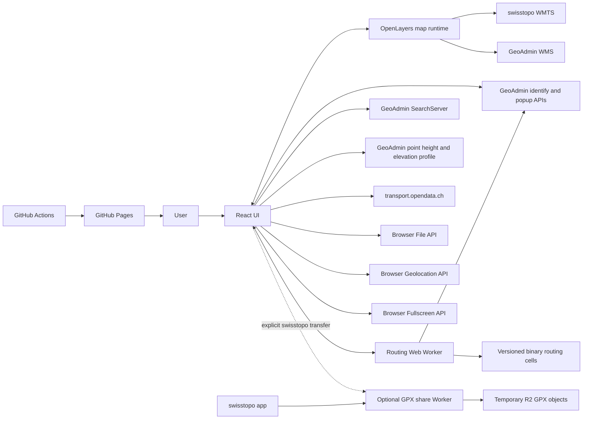
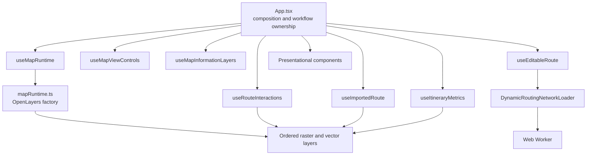
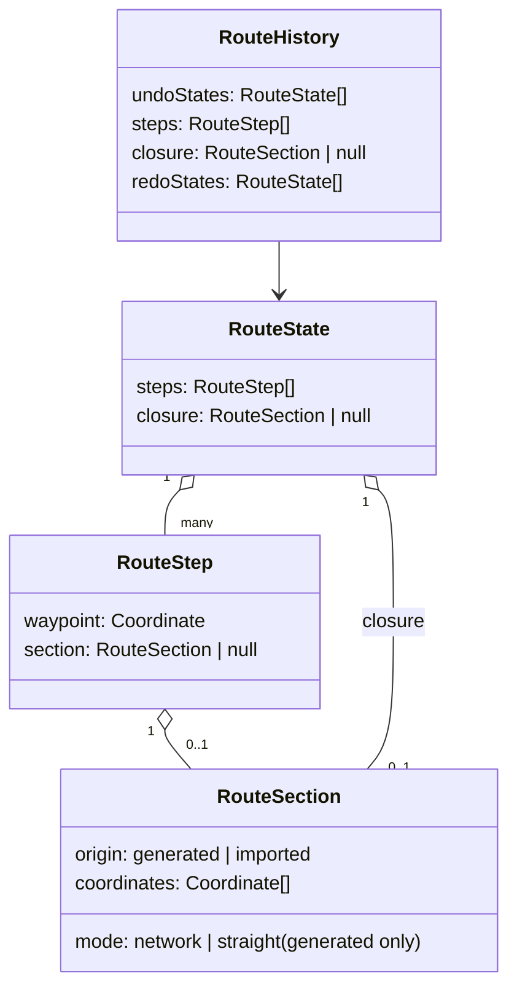
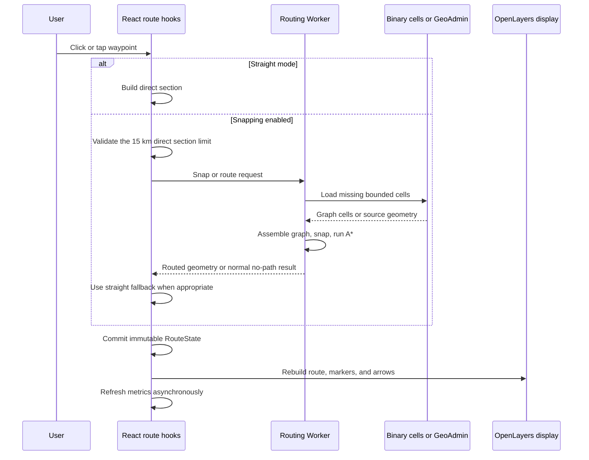
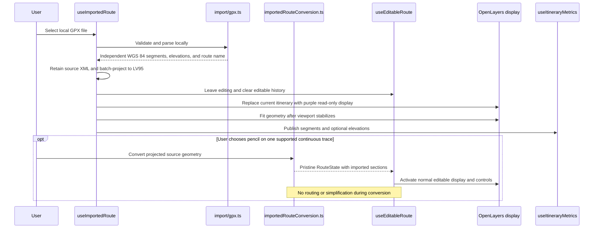

# Via Helvetica Architecture

## Executive summary

Via Helvetica is a map-centered application for planning one hiking route at a
time in Switzerland. React owns the user-interface state, OpenLayers owns the
imperative map runtime, and a dedicated Web Worker owns the CPU- and
network-intensive routing engine. The core application is deployed as static
files on GitHub Pages and still requires no account, user database, or persistent
route storage. An optional Cloudflare Worker exists only for the explicit
swisstopo hand-off: it stores the current named GPX temporarily in R2 so the
swisstopo app can fetch it by public URL. The default retention is 24 hours.
Larger-screen layouts receive a locally rendered QR code. Phone-width layouts
keep normal local GPX export only and do not expose the temporary swisstopo
hand-off.
Localized static entries at `/fr/`, `/de/`, `/it/`, and `/en/` expose
language-specific discovery metadata while
loading the same React/OpenLayers application.

The map and internal geometry use the Swiss LV95 projection (`EPSG:2056`).
Official swisstopo backgrounds and geodata are loaded directly from federal
services. Editable routes are stored as immutable route states with exact
section geometry, which makes undo, redo, reversal, and loop operations
predictable. Imported GPX itineraries initially remain read-only. A continuous
single-segment GPX inside the supported map extent can be converted explicitly
into editable route history without rerouting or simplifying its initial
geometry.

Routing is an experimental browser-side capability. It loads bounded
swissTLM3D cells around user-selected positions, builds a regional walkable
graph, snaps waypoints, and runs A* inside a Worker. Optional hiking geometry may
improve route preference, but provider degradation must not disable the required
road-and-path network. Runtime routing details live in
[ROUTING.md](ROUTING.md); offline import, generation, and publication live in
[ROUTING_DATA_PIPELINE.md](ROUTING_DATA_PIPELINE.md).

Information overlays—hiking closures, military danger zones, and public-
transport stops—remain independent from route calculation. They inform the user
but do not silently alter routing costs or connectivity.

## Technology stack

- React and TypeScript provide the user interface and application-state
  composition.
- OpenLayers and `proj4` provide the native LV95 map runtime and coordinate
  transforms.
- A dedicated Web Worker isolates routing-data loading, graph assembly,
  snapping, and A*.
- Vite provides development and static multi-page builds.
- Vitest and JSDOM provide deterministic regression tests.
- GitHub Actions and GitHub Pages provide continuous validation and static
  deployment.
- An optional Cloudflare Worker plus R2 binding provides 24-hour-by-default
  GPX URLs only for the user-requested swisstopo transfer.

## 1. Product and architectural constraints

### 1.1 Product focus

The application intentionally remains narrow in scope:

- the map occupies almost the complete viewport;
- only one current itinerary is shown at a time;
- an editable route can be created, reshaped, reversed, closed, and exported;
- one external GPX route can replace it as a read-only itinerary and, when
  continuous and inside the supported extent, can be explicitly converted into
  the editable-route domain;
- no route library, account system, or collaborative workspace is planned for
  the current product scope;
- the application is a planning aid, not a live-navigation or tracking tool.

The complete user-facing feature list belongs in the
[README](../README.md). This document concentrates on internal structure and
cross-module decisions.

### 1.2 Static core, no-account operation

The planning application itself is a static GitHub Pages deployment. The browser
contacts external map and geodata providers directly and performs route
calculation in a Web Worker.

This constraint provides several benefits:

- no registration is required;
- route planning and normal GPX download do not require a project service;
- there is no application database to operate;
- recurring infrastructure cost remains low;
- GitHub Pages can host the public application at
  [viahelvetica.ch](https://viahelvetica.ch/).

The optional swisstopo hand-off is intentionally narrower than a route backend.
Only an explicit swisstopo transfer action uploads the current named GPX
document. The temporary upload contract is capped at 2 MiB; larger imported GPX
files remain locally exportable but are not sent to the share Worker. That
document may be generated by Via Helvetica or retained from a current read-only
GPX import or its still-pristine editable conversion. The Worker validates a small GPX payload, stores it
below an isolated R2 prefix with an unguessable UUID and expiration metadata,
and serves it publicly for 24 hours by default so swisstopo can fetch it. GPX
responses force download semantics, disable caching and framing, and apply a
sandbox CSP because the payload can originate from an imported third-party GPX.
A scheduled cleanup removes expired objects. Expiry checks fail closed when
metadata is missing or invalid, and production deployment should add an R2
lifecycle deletion rule as an independent safety net. Browser CORS limits which
pages can use the endpoint directly, but it is not authentication; production
enables the optional Cloudflare Rate Limiting binding for `POST /gpx` and should
use a budget alert appropriate to the Cloudflare account.
No account, route library, editing API, or persistence semantics are introduced.
If `VITE_SWISSTOPO_SHARE_SERVICE_URL` is absent, the action is hidden and the
application remains completely static at runtime.

The precomputed national routing dataset remains static object storage rather
than an application service. Broader backend responsibilities should still be
introduced only when measured usage or product goals justify them.

### 1.3 Official-data preference

The map, topographic network, and safety information rely primarily on official
Swiss sources. Provider-specific limitations are handled explicitly: optional
enrichment should degrade before core route editing becomes unavailable.

### 1.4 Map-centered interface

Permanent controls remain small and float over the map. Larger surfaces are
contextual and temporary:

- layer selector;
- route action strip;
- information popups;
- elevation profile;
- GPX export dialog;
- one-time release-highlights dialog;
- About dialog.

The responsive layout resolves collisions by moving small controls rather than
permanently reserving large strips of viewport space. The route summary stays on
the bottom edge; at phone widths the metrics strip and optional profile span the
full viewport for editable routes, imported GPX itineraries, and selected
SwitzerlandMobility routes. A contextual imported-GPX edit action floats
immediately above the complete route-summary block instead of reserving a permanent
side gutter or separating an open elevation profile from the statistics strip.
The elevation profile keeps its intrinsic chart
aspect ratio and content-driven height so narrow screens do not visually exaggerate
relief merely to fill a panel. At phone widths the permanent search field is
replaced by a search button directly below route creation; activating it opens a
temporary full-viewport search surface that reuses the same query and result
logic. The layer selector and map-information details use full-width, fixed
half-height bottom sheets so part of the map remains visible while long content
uses browser-native scrolling. Opening the map/options sheet first dismisses any
map-information sheet occupying the same lower viewport region. Mobile temporary
surfaces follow an explicit stacking order: itinerary summaries, map-information
sheets, map/options, then full-screen search. The map-controls container is raised
only while map/options is open so itinerary summaries can otherwise remain above
the permanent floating controls. On phones the layer sheet is titled "Map and
options" and also contains the four language choices plus an About entry,
removing infrequently used permanent controls from the narrow map edge; desktop
keeps the direct language selector and About button. The common map-information
chooser used for overlapping safety, transport, and SwitzerlandMobility candidates
is also full-width on phones, but keeps a content-driven height for short lists
and only caps itself at half the viewport when native scrolling is actually
needed. While open, it temporarily owns the lower-map decision area instead of
competing with the current itinerary summary. Its candidate list uses the flexbox
space left by the localized header,
hint, and safe-area padding rather than a fixed height subtraction. These sheets
deliberately avoid custom drag gestures so ordinary taps, links, and scrolling
remain browser-native on touch devices. Outside route creation/editing, an empty
phone-map tap temporarily hides the floating controls, itinerary summaries, open
information panels, and an open Map and options sheet without clearing their state;
a second empty tap restores the same UI. Information features keep priority over this map-only toggle, and
desktop retains the existing dismiss-on-empty-click behaviour. The metric scale is
hidden where it would otherwise remain
covered by the summary. Tall temporary surfaces use the dynamic mobile viewport
height, with a conventional viewport fallback, so browser address and navigation
bars cannot cover their reachable content.

### 1.5 Explicit workflow boundaries

The application preserves three important boundaries:

1. **Editable route versus imported GPX** — a GPX remains an independent
   read-only itinerary until the user explicitly asks to edit a supported
   continuous trace; conversion then seeds editable history without routing.
2. **Information overlays versus routing** — closures, danger zones, and stops
   inform the user without changing the graph.
3. **React state versus OpenLayers runtime** — React coordinates workflows;
   OpenLayers objects remain behind focused imperative modules and hooks.

## 2. System context



### 2.1 External providers

| Provider or API | Purpose | Failure impact |
|---|---|---|
| Federal WMTS (`geo.admin.ch`) | Color, grey, aerial, hiking-trail, and SwitzerlandMobility hiking portrayals | Initial base-map failure is blocking; optional or later isolated tile failures are not |
| GeoAdmin SearchServer | Official place search | Localized, retryable search failure |
| GeoAdmin identify | swissTLM3D routing data and map-feature inspection | Routing requests may fail; information overlays remain non-blocking |
| GeoAdmin HTML popup | Localized closure and military metadata | Popup reports a local error without changing route state |
| GeoAdmin WMS | Closure, detour, and military danger portrayals | Overlay failure does not block map use |
| GeoAdmin point height and elevation profile | Explicit desktop point elevation plus route ascent, descent, and walking-time samples | Coordinates and distance remain available; altitude-dependent values become unavailable |
| Versioned static routing storage | Optional precomputed Swiss graph cells used by the Worker | Coverage misses use GeoAdmin for the affected operation; persistent delivery, compatibility, or integrity failures switch the complete session to GeoAdmin |
| Federal Office of Transport data | Passenger-stop geometry and attributes | Optional stop layer may be incomplete or unavailable |
| transport.opendata.ch | On-demand departure board | Stop remains visible even when departures fail |
| swisstopo app hand-off (`swisstopo.app/u/`) | Opens a public temporary GPX URL in the official mobile app | Optional transfer failure leaves normal GPX download available |
| Browser APIs | Local GPX, geolocation, fullscreen | Capability-specific failure only |

### 2.2 Coordinate systems

The map runtime, rendered overlays, editable route, imported route, and routing
graph use Swiss LV95 (`EPSG:2056`). This gives route distances, snapping
thresholds, hit tolerances, and routing cells a shared metre-based coordinate
system and avoids reprojecting the official WMTS map in the browser.

WGS 84 (`EPSG:4326`) is used only at exchange boundaries:

- browser geolocation input;
- SearchServer results and decimal WGS 84 coordinate input;
- GPX import;
- GPX export;
- geodesic calculations where required.

The search control also accepts LV95 directly and validates it against the
navigable map extent before publishing the selected point.

`src/map/projection.ts` registers LV95 through `proj4`, exposes the official
WMTS extent and resolution pyramid, and centralizes WGS 84/LV95 conversion.

## 3. Runtime composition

### 3.1 Component overview



### 3.2 Responsibility table

| Boundary | Main modules | Responsibility |
|---|---|---|
| Application composition | `src/App.tsx` | Connects focused hooks, resolves which temporary workflow owns the current itinerary, and owns modal state |
| Map lifetime | `src/map/mapRuntime.ts`, `src/map/useMapRuntime.ts` | Creates and disposes the single OpenLayers runtime; synchronizes startup and fullscreen state |
| Map controls | `src/map/useMapViewControls.ts`, `src/map/useMapLayerOpacities.ts`, `src/components/MapLayersSelector.tsx` | Background choice, persisted overlay visibility and opacity, zoom, fullscreen, and explicit geolocation; redundant +/- zoom buttons are hidden on small coarse-pointer devices |
| Information overlays | `src/map/useMapInformationLayers.ts`, `src/map/mapInformationChoice.ts`, `src/components/MapInformationChoicePanel.tsx`, `src/map/mapInformationViewport.ts`, `src/map/useSwitzerlandMobilityHikingSelection.ts`, `src/switzerlandMobility/hikingRoutes.ts` | Visibility, loading, cross-layer click candidate aggregation, common ambiguity choice, click-anchor visibility beside temporary panels, public-route selection and fitting, popup state, caching, and cancellation |
| Desktop point inspection | `src/map/useMapPositionInspection.ts`, `src/map/pointHeight.ts`, `src/map/mapPositionMarker.ts`, `src/components/MapPositionPanel.tsx` | Fine-pointer context-menu handling, temporary point marker, WGS 84/LV95 presentation and copy actions, cancellable GeoAdmin point-height lookup, and dismissal on the next map click |
| Editable-route domain | `src/map/routeState.ts`, `src/map/useEditableRoute.ts`, `src/map/importedRouteConversion.ts` | Immutable route state and section provenance, history, lossless single-trace GPX conversion, snap mode, serialized mutations, and route actions |
| Pointer interaction | `src/map/useRouteInteractions.ts`, `src/map/routePointerInteraction.ts` | Waypoint and section hit detection, drag previews, click/drag lifecycle, and semantic edit requests |
| Route presentation | `src/map/routeDisplay.ts`, `src/map/itineraryDirection.ts`, `src/map/itineraryEndpoints.ts` | Committed geometry, previews, zoom-aware waypoint decluttering, direction arrows, and A/B markers |
| Imported GPX | `src/import/gpx.ts`, `src/map/useImportedRoute.ts`, `src/map/importedRoute.ts` | Local parsing, projection, initial read-only display, retained source XML/elevation, and responsive view fitting |
| GPX export | `src/export/gpx.ts`, `src/export/itineraryExportSource.ts` | Generated GPX serialization plus regression-tested selection of exact imported XML while converted geometry remains pristine |
| Metrics | `src/metrics/routeMetrics.ts`, `src/metrics/useItineraryMetrics.ts`, `src/map/useRouteProfileSynchronization.ts` | Distance, elevation request identity, ascent/descent, hiking time, profile samples, and exclusive map/profile synchronisation for the active itinerary or selected public route |
| Routing | `src/routing/` | Worker protocol, bounded provider loading, caches, graph construction, snapping, and A* |
| Offline routing data | `routing-data.config.example.json`, `scripts/generate-routing-geometry-cells.py`, `scripts/generate-precomputed-binary-routing-graph.mjs`, `scripts/verify-routing-dataset.mjs`, `scripts/upload-routing-dataset-r2.ps1` | External source/work/release paths, national import, binary compilation, verification, and immutable R2 publication |
| Public-transport stop data | `public-transport-data.config.example.json`, `scripts/download-public-transport-stops-source.mjs`, `scripts/prepare-local-public-transport-stops.mjs`, `scripts/verify-public-transport-stops-release.mjs`, `scripts/upload-public-transport-stops-r2.ps1`, `scripts/verify-published-public-transport-stops.mjs` | STAC source discovery, validated FOT import, compact static catalog preparation, source-fingerprint provenance, Brotli publication, and local/public verification |
| swisstopo hand-off | `src/share/`, `src/components/RouteExportDialog.tsx`, `workers/swisstopo-gpx-share/` | Builds the documented `/u/` URL, renders a QR outside phone-width layouts, uploads GPX only on explicit request, and expires temporary R2 objects |
| Search | `src/search/locationSearch.ts`, `src/search/coordinateSearch.ts`, `src/components/LocationSearch.tsx` | Local WGS 84/LV95 parsing, provider contract, session cache, result UI, keyboard navigation, and request cancellation |
| Localization | `src/i18n/`, `scripts/generate-localized-pages.mjs` | Typed dictionaries, language persistence, locale paths, runtime document metadata, and generated localized HTML entries |
| Release history | `src/releases/`, `src/components/ReleaseNotesDialog.tsx`, `scripts/templates/releases.html` | Returning-visitor release acknowledgement, compact localized highlights with one explicit footer dismissal, a signposted new-tab history link, a distinct current-version display and history action in About, and generated indexable release-history pages |
| Static deployment | `.github/workflows/deploy.yml`, `vite.config.ts` | Test, build, Pages deployment, and root-relative production assets |

### 3.3 Application composition

`App.tsx` is intentionally a composition point rather than a second map engine.
It accesses one stable `MapRuntime` reference and coordinates independent
capabilities. The application uses no external global state store: focused hooks
own their domain and lifecycle state, while `App.tsx` composes their public state
and actions. Examples of cross-workflow coordination include:

- starting route creation clears an imported GPX and temporary search marker;
- a successful GPX import leaves route mode and clears editable history;
- the contextual pencil action can seed editable history from one continuous
  imported GPX without calling the routing provider, then clears only the
  read-only map representation while retaining its source document for pristine
  export;
- opening the About dialog closes map-feature information;
- a newer release opens once for returning visitors after the initial map is
  usable, while first-time visitors and unavailable storage skip the courtesy
  dialog; closing it records only the acknowledged version in browser storage;
- selecting a SwitzerlandMobility route keeps the previous itinerary until complete
  public geometry has been validated, then clears editable history or an imported
  GPX and makes the selected public route the single current read-only itinerary;
- changing language updates the shareable locale path through the History API,
  clears temporary search state and provider selections, and preserves the
  loaded map and current itinerary;
- a valid import or route change becomes the single current itinerary for
  metrics.

Imperative OpenLayers sessions, provider requests, route history, and Worker
caches remain owned by focused hooks or modules rather than by `App.tsx`.

## 4. Core state model

### 4.1 Editable route

The editable route is represented by immutable `RouteState` snapshots.

A route contains ordered `RouteStep` values. Each step stores the displayed
waypoint and its incoming `RouteSection`; only the first step has no incoming
section. Section provenance is explicit:

- `generated` sections carry the `network` or `straight` mode that produced
  their geometry;
- `imported` sections carry an untouched slice of a converted GPX and no routing
  mode because Via Helvetica did not calculate that geometry.

A closed route additionally stores one `RouteClosure`, which is the same
`RouteSection` type, for the exact final section from the last waypoint back to
the first. The closure does not create a second visible start waypoint.



Snapshot history is deliberate. Undo and redo exchange complete stored states,
so exact geometry is restored without recalculation or another provider request.
Moving, inserting, or deleting a waypoint, reversing the route, and closing or
reopening the loop each form one undoable edit. A new edit clears the redo
stack. Complete deletion clears route history intentionally.

### 4.2 Imported GPX

An imported GPX initially becomes the current read-only itinerary. It remains a
collection of independent projected segments so deliberate gaps between GPX
track segments are never connected artificially.

The import workflow owns:

- file-size validation;
- local XML parsing;
- retention of the original GPX XML while the read-only itinerary is current;
- stale-read protection;
- batched WGS 84 to LV95 projection;
- optional embedded elevations;
- read-only purple display;
- start/finish and direction markers;
- responsive `View.fit()` framing.

For one continuous segment entirely inside `MAP_EXTENT`, the statistics bar
exposes a contextual pencil action. `importedRouteConversion.ts` then creates
editable anchors on existing source vertices. The spacing is adaptive:
longer routes prefer about 1 km between anchors, while routes shorter than about
3 km aim for at least three editable sections so short traces still expose useful
interior handles. Around 500 editable sections (roughly 501 anchors on an open route) is a preference rather than a hard limit:
very long traces may use more anchors so imported sections remain comfortably
below the 15 km network-routing limit. The editable workflow currently rejects
continuous traces above 20,000 projected source vertices instead of silently
thinning them. GPX files above that ceiling remain available in read-only mode.
Every incoming section is a copied slice of
the original projected geometry marked `origin: 'imported'`. Conversion performs
no snapping, routing, interpolation, or simplification, so the displayed line is
identical to the imported geometry before the first edit.

The read-only OpenLayers representation is removed after conversion and the
normal editable-route controls become active. Waypoint display density is then
resolved in screen space: route state keeps every anchor, while the presentation
threshold grows progressively on regional views and shrinks again for detailed
editing. Hidden anchors reappear automatically on zoom. Start, finish, and the
actively dragged waypoint always remain visible. The same visible-anchor set
feeds direction-arrow avoidance, so arrows do not reserve space around hidden
handles. Direction arrows remain eligible on moderately broader regional views
than before, with a smaller exclusion margin around visible handles; curvature
checks and the existing per-line cap still prevent misleading or excessive
symbols. `App.tsx` nevertheless retains the
source XML, embedded elevation summary, and the exact pristine `RouteState`
references. Reference identity therefore determines whether an undo has returned
to the untouched imported state without maintaining a separate modified flag.
While pristine, export can still use the original GPX document and metrics can
still reuse embedded elevations. Once an edit commits different route-state
references, normal generated-route export and GeoAdmin elevation processing take
over. `src/export/itineraryExportSource.ts` keeps the imported-versus-generated
export decision pure and regression-tested so a modified route cannot silently
fall back to stale source XML.

Multi-segment GPX files remain read-only in this first implementation rather
than inventing links across deliberate gaps or expanding the editable domain to
multipart routes. Starting a new editable route still removes a read-only GPX
without converting it.

### 4.3 Selected SwitzerlandMobility route

A selected public route is another read-only current itinerary. The selection
workflow retains independent LV95 segments, public identity metadata, calculated
metrics, and the elevation samples required by its profile and GPX export.

The previous editable route or imported GPX is cleared only after complete public
geometry has been retrieved and validated. Identification, ambiguity resolution in
the common chooser, or a failed geometry request therefore cannot destroy the
user's current itinerary.

### 4.4 Shared current-itinerary metrics

`useItineraryMetrics` receives either editable-route segments or imported-GPX
segments. It calculates distance immediately and then resolves altitude-
dependent values from an applicable embedded GPX elevation summary or the
GeoAdmin elevation-profile service. A converted GPX keeps its embedded summary
only while route-state reference identity still matches the pristine conversion;
the first committed route edit switches the complete editable route to
GeoAdmin instead of mixing altitude sources section by section.

Independent segments sent to the GeoAdmin profile service share one global
sampling budget. This keeps profile size bounded when provider geometry contains
genuine gaps instead of multiplying the normal limit by the number of parts.

Complete embedded GPX elevations are resampled on a regular distance grid
that targets roughly 20 metres, while GeoAdmin-backed metrics accumulate the
valid profile samples returned by the provider. The same route geometry may
therefore produce slightly different ascent/descent values after GPX export and
re-import.

Every asynchronous result is tied to the exact immutable segment-array identity
that requested it. Superseded requests are aborted, and stale responses cannot
update a newer itinerary.

The same profile samples support:

- ascent and descent;
- the Schweizer Wanderwege hiking-time estimate;
- the collapsible SVG profile;
- map-to-profile pointer lookup;
- profile-to-map pointer lookup.

## 5. Main workflows

### 5.1 Application startup

1. `main.tsx` mounts React and the language provider from either the root or a
   localized static HTML entry.
2. The language provider gives an explicit `/fr/`, `/de/`, `/it/`, or `/en/`
   path priority over stored and browser preferences, then keeps the path and
   document metadata synchronized without reloading the application.
3. `useMapRuntime` creates the single OpenLayers runtime after the map target is
   mounted.
4. `mapRuntime.ts` creates the LV95 view, explicit layer order, displays, and
   transient markers.
5. Focused hooks apply persisted background, overlay visibility, and opacity
   choices without recreating the map.
6. Once the initial map is usable, the current release dialog opens only for a
   returning visitor whose stored acknowledgement is older and whose browser can
   persist the dismissal. A first visit records the current version silently.
7. Optional providers begin work only when their layer, zoom, or user action
   requires it.

### 5.2 Editable-route creation



The first snapped waypoint loads only cells intersecting its maximum snapping
box. Before any later section reaches the Worker, the editable-route controller
checks that its intended endpoints are no more than 15 km apart in direct LV95
distance. The same product rule covers additions, waypoint movement, insertion,
deletion reconnection, and loop closure. A rejected edit keeps the committed
route unchanged and asks for an intermediate waypoint; explicit straight mode
remains unrestricted because it does not load swissTLM3D data.

Admitted sections load a bounded footprint between the existing endpoint and
the new selection. Binary routing starts with a typical-case discrete metric
envelope and
widens only when its A* frontier diagnostic cannot certify the result. A snap
miss stops once both endpoint footprints are covered, while an uneconomical or
still-inconclusive metric sequence returns to the complete legacy radius-1 then
radius-2 workflow. GeoAdmin keeps that unchanged legacy policy throughout.

Normal absence of coverage is different from provider failure. Missing nearby
network data may produce a free first waypoint or a straight incoming section,
while request, parsing, and safety-limit failures leave the existing route
unchanged and surface an actionable message.

See [ROUTING.md](ROUTING.md) for cell selection, caching, provider fallback,
graph construction, snapping, and A*.

### 5.3 Route reshaping

Pointer interaction stays separate from route calculation:

- waypoint or route-section hit detection begins a possible gesture;
- pointer movement renders temporary straight previews only;
- dragging near a viewport edge auto-pans the OpenLayers view and keeps the
  preview attached to the coordinate under the stationary pointer;
- window-level pointer release, focus-loss, and page-visibility guards cancel an
  abandoned drag and stop its animation before restoring committed geometry;
- no routing request is performed during drag;
- release emits one semantic move, insertion, or deletion request;
- `routeEditing.ts` rebuilds only affected sections using the snap mode selected
  at release;
- the edit is committed as one immutable history entry;
- a failed recalculation restores the last committed display.

This separation keeps drag feedback responsive and prevents provider traffic for
every pointer movement.

### 5.4 Reversal, loop closure, and export

Route reversal reuses stored geometry rather than routing again. Open routes
reverse waypoint order and swap A/B endpoints. Closed routes rotate reversed
sections around the original start so the combined A/B marker stays at the same
physical point while travel direction changes.

Loop closure adds a dedicated final section and does not duplicate the start
waypoint. Closing and reopening are undoable snapshots.

GPX export and swisstopo hand-off share the same naming workflow:

- the contextual export/share control stays in the right-side map controls and
  appears only while an editable route, imported GPX, or fully selected
  SwitzerlandMobility route is the current itinerary; for a selected public route
  it remains disabled only while elevation samples are still loading;
- the dialog asks for a route name once;
- editable and selected public routes use Via Helvetica's GPX serializer;
  generated sections are simplified independently so every waypoint remains
  exact, while untouched imported sections retain their original vertices;
- a read-only imported GPX, or a converted GPX whose editable state is still
  pristine, keeps its original XML, metadata, extensions, geometry, and
  track/route structure; only itinerary-level names are added or changed when the
  user edits the proposed name;
- after a converted route is modified, export intentionally becomes a generated
  GPX document: untouched imported section geometry is retained, but source
  timestamps, extensions, and other provider-specific document structure are no
  longer promised;
- independent read-only geometry remains separate GPX track segments when Via
  Helvetica serializes it, so provider gaps are not connected artificially;
- valid elevation samples are merged without creating centimetre-scale duplicate
  points;
- LV95 geometry is converted to WGS 84;
- the serializer writes a GPX 1.1 track with metadata bounds and omits
  presentation whitespace so generated exchange files remain compact;
- **Export GPX** starts the existing local browser download and uploads nothing;
- the swisstopo transfer action, when configured, POSTs that same GPX to the
  optional Worker and receives a temporary HTTPS URL;
- the browser base64url-encodes that URL behind the official
  `https://swisstopo.app/u/` prefix; layouts wider than the 700 CSS px phone
  breakpoint render the QR code locally, while phone-width layouts keep only
  normal local GPX export and never expose the temporary share action;
- changing the route name invalidates a generated QR because the uploaded GPX no
  longer corresponds to the current form value.

### 5.5 GPX import



A slower file read is ignored after a newer selection, route creation, or
unmount invalidates its session. Invalid imports leave the current itinerary
untouched. Unsupported multi-segment or out-of-extent GPX files remain read-only.
For a supported conversion, `App.tsx` retains the source XML separately from the
read-only map state so pristine export and undo-to-pristine can still recover the
original document contract.

### 5.6 Information-layer inspection

`useMapInformationLayers` owns one map-click pipeline outside route mode. A click
is treated as a geographic question rather than as a request for whichever layer
happens to answer first. The coordinator first resolves any genuinely rendered
public-transport stop hit, including its hidden declutter neighbours, then
identifies every visible remote information layer that can participate at the
current zoom. Closure, SwitzerlandMobility, and military danger-zone identify
requests run concurrently so provider latency cannot become an accidental
selection priority.

When exactly one candidate matches, its existing detailed workflow opens
directly. When several candidates share the click, one compact bottom-centred
chooser groups them in explicit product order:

1. hiking safety information: closures/detours, then shooting notices/danger zones;
2. public-transport stops;
3. SwitzerlandMobility hiking routes.

The chooser contains only lightweight identify data. Closure and military HTML,
public-transport departures, and complete SwitzerlandMobility geometry are loaded
only after one concrete item has been selected. This keeps the map responsive and
ensures that a local service feature such as a bus stop can never prevent access
to official safety information or a named hiking route beneath the same click. A
failing remote identify service is logged but does not discard successful
candidates from other layers.

For stop, closure, and danger-zone panels, the exact click coordinate remains
the visual anchor and the zoom remains unchanged. Stops use the smallest pan
needed to keep their point visible. A closure or danger-zone click that would be
hidden or leave too little surrounding context is placed near the centre of the
largest useful map region outside the measured panel. Panel size changes are
observed because timetable and provider content can arrive after the initial
render. This click-based rule avoids trying to fit a potentially long closure
line or a broad, irregular danger-zone polygon.

Visibility, zoom, language, and workflow changes abort obsolete requests and
clear stale selections. These overlays never mutate route geometry or routing
costs.

### 5.7 Search, geolocation, fullscreen, About, and releases

Location search first applies a strict local parser to the complete input. It
accepts decimal WGS 84 and Swiss LV95 coordinate pairs, detects safely reversible
axis order inside the Swiss map extent, and reports valid coordinates outside
that extent without contacting GeoAdmin. Unfinished input with strong coordinate
markers remains local and keeps the result panel closed, while ordinary numeric
place searches such as postal codes still reach SearchServer. Text searches then
use a bounded language-aware session cache and abort superseded uncached requests.
The same `LocationSearch` state and provider workflow serves both presentations:
a permanent compact field on larger screens and a temporary full-viewport surface
opened from the right-side search button on phones. Provider labels are converted
to plain text before React renders them. Selecting a place frames the broader
planning context; selecting an exact coordinate uses the closer geolocation scale.
Either result creates a temporary marker that is cleared when a higher-priority
workflow takes ownership.

Desktop fine-pointer users can also right-click the map to inspect an exact point
without entering the left-click information-layer pipeline. The browser context
menu is suppressed only for this supported desktop map gesture; OpenLayers controls
and attribution links retain their native context menu. A dedicated marker, using
the same visual language as exact coordinate search, appears immediately; WGS 84
is derived locally from the native LV95 click while the official GeoAdmin
point-height service loads the terrain elevation independently. The compact
lower-map panel applies the same minimal `keep-visible` pan as point-information
panels when it would cover the inspected marker, without changing zoom. A newer
right-click, ordinary map click, panel dismissal, or unmount aborts obsolete height
work. The panel temporarily replaces itinerary summaries but preserves the current
SwitzerlandMobility selection, route geometry, loaded metrics/profile, and
information-layer visibility. Itinerary summaries stay mounted and are only hidden
while inspection owns the lower map area, so local presentation state such as an
expanded elevation profile returns unchanged when inspection closes. No mobile
long-press equivalent is introduced.

Geolocation is requested only after explicit user action. A valid WGS 84
position is converted to LV95, checked against the configured extent, displayed,
and centered. Continuous tracking is not used.

Fullscreen requests target the complete application root. A
`fullscreenchange` listener remains the source of truth and schedules
`map.updateSize()` after viewport changes.

The About dialog contains project context, experimental-routing guidance,
creator and support details, source and license links, professional profile, a
link to the localized release history, and complete data credits. Larger screens
keep a direct map control, while phones expose the same dialog from the Map and
options sheet so an infrequently used action does not consume permanent map space.

The release dialog reads the current semantic version and the highlights marked
for compact display from `src/releases/releaseHistory.json`; history-only items
remain available on the static page. It opens only after the map has reached its
usable startup state, only for a returning visitor whose acknowledgement is
older, and only when at least one compact highlight exists. A first visit records
the current version silently. Because version 1.0.0 had no release key, the
existing language preference acts as the migration marker for a returning
visitor. Storage read or write failures suppress this courtesy dialog rather
than risking a modal that returns on every load. Closing
the dialog or opening the complete history stores the current version. The
history link visibly indicates that it opens a localized static page in a new
tab so the current itinerary is not lost.

## 6. Map and geodata integration

### 6.1 Native LV95 map

`src/map/config.ts` and `src/map/projection.ts` define the official LV95 WMTS
grid instead of using an XYZ/Web-Mercator shortcut. Base-map replacement keeps
the same view and overlays.

Selectable backgrounds include:

- official color national map;
- official grey national map, including its detailed source at close zoom;
- SWISSIMAGE aerial imagery.

The rendered hiking-trail layer and optional `ch.astra.wanderland` WMTS layer
add the ordinary official hiking portrayal and the green national, regional, and
local SwitzerlandMobility routes. The green layer starts disabled. Ordinary
hiking trails and trail closures start at 80% opacity, SwitzerlandMobility routes
and military danger zones at 60%, and public-transport stops at 100%; these
defaults balance readability with visibility of labels, roads, and terrain
underneath. The shared layer menu exposes an expandable opacity slider for every
information layer, bounded from 20% to 100%. Complete hiding remains the role of
the visibility toggle, avoiding an apparently enabled but invisible layer. A
layer's settings button is disabled while that layer is hidden, and its temporary
slider closes when visibility is removed because opacity changes would have no
visible feedback.

Only explicit slider changes are persisted in browser storage. Product defaults
therefore remain free to evolve for visitors who never adjusted a layer, and one
slider gesture updates only the corresponding OpenLayers portrayal. Visibility
and opacity preferences remain independent and do not recreate the map. Any
selection overlay created by an explicit click—selected SwitzerlandMobility
route, military danger zone, or public-transport stop—remains opaque while the
overview portrayal follows the visitor's chosen opacity.

The rendered portrayals remain independent from the vector hiking geometry used
to influence route costs.

### 6.2 Ordered layers

The runtime creates one explicit layer order. In broad terms:

1. selected raster background;
2. rendered hiking-trail portrayal;
3. optional green SwitzerlandMobility hiking routes;
4. selected SwitzerlandMobility route vector and closure WMS overlay;
5. public-transport and military information vectors and portrayals;
6. imported read-only itinerary;
7. editable route;
8. temporary search, inspected-position, and user-location markers.

Route and endpoint readability takes priority over informational overlays.
Layer construction remains centralized so later features do not depend on
implicit insertion order.

### 6.3 SwitzerlandMobility route inspection

Outside route-creation mode, the information-layer click pipeline can identify a
feature beneath the optional `ch.astra.wanderland` portrayal. Identification first
requests public metadata only. A single route is selected immediately only when
no other map-information candidate shares the click; multiple named routes, or a
route coinciding with safety or public-transport information, are resolved by the
common bottom-centred map-information chooser before any complete geometry is
loaded.

After selection, a focused get-feature request retrieves the complete public
geometry in LV95. Once that geometry is validated, the workflow clears any
editable route or imported GPX and the public route becomes the single current
read-only itinerary. A temporary vector layer draws an opaque dark-green line with
a white casing above the semitransparent overview. The view fits the complete
selected geometry once, with responsive bottom padding for the panel and the same
maximum fit zoom and screen margins used by GPX imports. These margins keep route
endpoints clear of the search field, the right-side map controls, and the compact
bottom panel. Closing the panel clears the highlight and pending requests but
preserves the fitted map view, so an explicit close does not undo the user's new
navigation context.

The panel uses public route identity, route number, stage number, and localized
section text. Distance, ascent, descent, walking time, and profile samples are
calculated by Via Helvetica from the retrieved geometry and the existing
elevation-profile service; no SwitzerlandMobility editorial descriptions or photos
are reproduced. The profile is collapsed by default and reuses the same chart and
black map marker as editable routes and imported GPX tracks. The shared right-side
export control reuses the naming dialog and writes the complete selected geometry
as a GPX 1.1 track, preserving independent line segments and embedding calculated
elevations when available. A shared synchronization hook grants marker ownership
only to the visible summary. Starting route creation, hiding the layer, changing
language, or selecting another map information feature clears the selection and
profile state. Desktop map-position inspection is deliberately non-destructive:
it temporarily hides the SwitzerlandMobility summary while preserving the selected
route, loaded metrics/profile, and local panel state.

### 6.4 Hiking closures and military danger zones

Both safety layers use official server-rendered WMS portrayals and localized
feature inspection. They are enabled independently and persist their visibility
choice.

The returned information is advisory. Via Helvetica does not automatically
avoid a visible closure or military zone because:

- provider records may require human interpretation;
- current applicability may depend on dates or local conditions;
- information-layer availability should not change graph connectivity silently.

### 6.5 Public-transport stops

The source dataset contains passenger stops as well as technical, retired, and
operational records. Via Helvetica therefore loads vector features and applies a
project-owned normalization layer rather than rendering the complete source
portrayal.

The stop workflow separates:

- provider loading and recursive subdivision;
- passenger-mode normalization and filtering;
- buffered viewport reuse;
- OpenLayers rendering and collision fan-out;
- deterministic screen-space decluttering at broad and medium scales;
- selected-stop presentation;
- on-demand timetable loading.

Both position providers use the same canonical stop identity: the FOT DiDok
service number stored as seven digits (two-digit UIC country code plus five
digits). The downloaded `PointExploitation.Numero` field and the GeoAdmin
feature id for `ch.bav.haltestellen-oev` expose that same value. Via Helvetica
keeps it unchanged as both `id` and `stationId`; only the timetable adapter may
retry a zero-padded nine-character representation required by some API examples.

An optional static catalog can replace GeoAdmin viewport loading by setting
`VITE_PUBLIC_TRANSPORT_STOPS_CATALOG_URL`. The same browser contract accepts a
root-relative development artifact or an immutable object-storage URL; leaving
the setting empty selects GeoAdmin instead. A configured catalog URL is
authoritative for that build: a catalog loading failure does not switch to
GeoAdmin automatically at runtime. The catalog is loaded lazily on first
stop-layer use, validated against its source fingerprint and record count,
normalized once, and indexed in a lightweight LV95 grid. Viewport calls query
only intersecting cells, so the national catalog never becomes tens of thousands
of OpenLayers features.

The compact schema stores stop records as tuples and interns repeated provider
transport descriptions and stop types into top-level dictionaries. The browser
expands those dictionary indexes before calling the shared passenger-stop
normalizer; transport classification and retirement rules therefore remain in
one runtime module. The national index classifies each dictionary entry once
rather than repeating Unicode and regex work for every raw record. The shared
catalog download deliberately survives superseded viewport calls, while those
calls are still discarded before and after the load.

Published stop catalogs use content-derived immutable release identities. The
offline preparation step records the source CSV basename, complete SHA-256,
source byte length and final record count, and release
paths include a short source fingerprint plus the schema version. A pre-compressed
Brotli object is served as JSON with HTTP `Content-Encoding: br`; corrected or
new source data must use a new release path rather than overwrite an existing
one. Source acquisition, preparation safeguards, release layout, R2 upload, and
public verification belong in `docs/PUBLIC_TRANSPORT_DATA_PIPELINE.md` rather
than this application-wide architecture document.

Stop coordinates are treated as static within one published catalog release.
New official source data is published under a new immutable release path when
stops are added, removed, or moved. Distinct stops within the close-stop threshold
can be fanned out temporarily when their icons overlap. The anchored
fan-out grouping uses a 60 m LV95 candidate grid, preserving deterministic
identifier ordering while avoiding an all-pairs scan during proactive viewport
refreshes. Newly loaded features start visually hidden until the first
rendered-frame decluttering pass, which avoids flashing the complete dense-city
buffer. Decluttering then runs
after fan-out in CSS-pixel space, hides only the style of lower-priority features,
and leaves every stop loaded in the vector source. Members of the same
fan-out group do not suppress each other while that fan-out is active; once real
coordinates are sufficiently separated and fan-out is released, ordinary
collision rules apply again. Decluttering is refreshed from a rendered map state
so symbol sizes and coordinate-to-pixel transforms describe the same view.
Buffered viewport refreshes reconcile features by official stop id instead of
clearing and rebuilding the whole source. Stops shared with the previous buffer
therefore keep their rendered visibility while newly entering stops wait for the
next decluttering pass, avoiding a whole-layer blink when panning into new data.
The stop vector layer rebuilds its OpenLayers feature batches during interactions
and view animations. For the static local catalog, centre changes are also checked
at most once per animation frame. The current 1.5x data envelope is refreshed
before its remaining off-screen reserve falls below 10 percent of the viewport
width or height, so entering and leaving features are reconciled while they are
still outside the visible map. This proactive policy is deliberately local-only:
GeoAdmin keeps the `moveend` debounce and ordinary containment rule because a
single refresh can recursively fan out into many remote `identify` calls. The
vector layer is explicitly invalidated after decluttering only when at least one
stop actually changes rendered visibility. Reconciliation follows the same rule:
silent updates of reused features invalidate the layer and decluttering snapshot
only when symbol metadata or fan-out layout really changes; identical buffered
refreshes preserve the previous rendered state without rebuilding the replay group.

A rendered stop hit may contribute hidden declutter neighbours to the common
map-information chooser, but an invisible stop alone is never a click target. If
the click also intersects safety information or SwitzerlandMobility routes, all
those candidates remain available in that same chooser, with public transport
listed before the public routes. The rendered stop representative keeps temporary
decluttering priority while slower remote identification is pending, so the symbol
that was actually clicked does not swap with a hidden neighbour. This priority does
not present the stop as selected; only a concrete user selection receives the halo
and keeps visual priority. The timetable is requested
only after one concrete stop has been selected. A buffered request extent reduces
repeated traffic during nearby pans. Zoom, canvas-size, language, or visibility
changes invalidate reuse. Timetable errors do not remove the selected stop or its
official SBB/CFF/FFS links.

## 7. Routing boundary

Routing is a specialized subsystem with its own Worker, protocol, provider
strategy, caches, graph model, and validation scope. `ARCHITECTURE.md` documents
its contract with the rest of the application; algorithmic, binary-format, and
publication details belong in the dedicated routing documents.

The subsystem receives plain LV95 coordinates and returns structured-clone-safe
snap or route results. OpenLayers objects and React state never cross the Worker
boundary. Network loading, graph assembly, snapping, and A* therefore remain
isolated from the map and user-interface thread.

The required graph comes from official swissTLM3D roads and paths. GeoAdmin can
supply bounded source geometry at runtime, while an explicitly configured
versioned binary dataset can supply equivalent precompiled graph cells. Optional
hiking geometry influences route preference but is not required for basic
connectivity; if that enrichment becomes unavailable, required road-and-path
routing continues.

The provider session keeps the binary and GeoAdmin engines independent. Coverage
misses near the published dataset boundary use GeoAdmin only for the affected
operation. Persistent binary delivery, compatibility, or integrity failures
trigger a one-way fallback to GeoAdmin for the rest of the browser session, so
graph representations are never mixed and failed binary storage is not probed
again on every edit. Intentional cancellation does not cause fallback.

The typed-array binary graph has a bounded-search diagnostic that marks whether
A* expanded a node outside the cells whose complete data was loaded. Node
membership is precomputed into a compact byte array during graph assembly, and
the diagnostic is enabled only for cells carrying the validated manifest
contract for complete unclipped features and global graph identity. The binary
engine uses this signal to certify discrete 400 m, 700 m, 1,100 m, 1,600 m, or
2,400 m metric envelopes. Snap misses are final once both 260 m endpoint
footprints are covered, and the engine returns to the full legacy
radius-1/radius-2 workflow whenever the metric sequence is no longer smaller,
remains inconclusive, or lacks diagnostics. A normal radius-1 path is accepted
before the wider radius-2 retry. The object-based GeoAdmin graph and its policy
remain unchanged.

Precomputed releases are generated reproducibly from official swissTLM3D source
data outside the repository, published below immutable versioned roots, and
activated through `VITE_ROUTING_DATA_BASE_URL`. The browser reads only published
runtime artifacts; it never reads the maintainer's local source, workspace, or
publication configuration. Public verification checks object integrity, cache
metadata, and the browser-origin CORS contract before a release is considered
usable.

For provider selection, corridor policy, graph construction, snapping, A*, cache
behaviour, fallback semantics, tuning values, and runtime validation, see
[ROUTING.md](ROUTING.md). For the external filesystem, GeoPackage import, binary
build, verification, and immutable publication workflow, see
[ROUTING_DATA_PIPELINE.md](ROUTING_DATA_PIPELINE.md).

## 8. Performance and concurrency

### 8.1 Dedicated Worker

Network loading, optional source-geometry compilation, corridor graph joining,
snapping, and A* stay outside the React/OpenLayers thread. The map remains
interactive while routing work runs. Binary precomputed cells remove source
compilation and replace string-key and per-node object assembly with global
integer IDs, typed arrays, and CSR, while preserving the Worker boundary for
indexing and search.

### 8.2 Bounded work

Provider activity is constrained by:

- a 15 km product-level direct-distance limit checked before network work;
- regular routing cells;
- corridor-based loading rather than national data loading;
- a maximum cell count per operation;
- bounded request and cell concurrency;
- recursive subdivision only when provider result limits require it;
- one wider-corridor retry rather than unbounded expansion.

The national binary representation follows the same corridor and cell-count bounds,
but replaces recursive identify requests with one file request per non-empty
cell. Empty cells are resolved from the manifest without a request. Out-of-region
halo cells are ignored when a corridor still contains covered cells; a completely
out-of-region footprint remains an explicit coverage error. The binary provider
avoids runtime interpretation of source road attributes and performs numeric
rather than string-based cross-cell joining.

### 8.3 Session caches

The routing Worker keeps:

- a least-recently-used raw-cell cache with an approximate 64 MiB byte budget;
- reusable cell-owned in-flight requests with independent consumer cancellation;
- at most two exact-corridor graphs, additionally bounded by an approximate
  128 MiB retained-size budget.

The estimates deliberately over-approximate JavaScript object, adjacency, and
spatial-index overhead. Binary graphs also retain one byte per local node for
loaded-cell frontier membership. One oversized current entry is retained so an
active operation can complete; real browser-memory measurements remain part of
routing validation.

The binary snapping index traverses only the 250 m buckets touched by each edge,
including both side buckets when a segment passes exactly through a grid corner.
This keeps index growth proportional to edge length rather than to the area of a
diagonal edge's bounding rectangle. A high linear bucket-count guard remains in
place to reject corrupted coordinates before they can exhaust the Worker heap.

Other focused caches include:

- language-specific location-search results;
- buffered public-transport viewport coverage;
- short stationboard responses;
- memoized directional-arrow geometry and styles;
- immutable elevation/profile samples.

Caches remain session-local and do not create persistence semantics.

### 8.4 Cancellation and stale-result guards

Every owner cancels work it supersedes:

- search effects abort older queries;
- information-layer changes abort identify and popup work;
- route mode changes abort active routing;
- new metrics abort older elevation requests;
- GPX sessions ignore obsolete file reads;
- Worker protocol messages support explicit cancellation.

Where platform work cannot stop immediately, request identity and immutable
references prevent obsolete completion from mutating current state.

### 8.5 Presentation performance

The route and elevation profile avoid unnecessary React churn:

- drag previews remain in OpenLayers rather than React state;
- direction arrows are resolution-aware and capped;
- cumulative geometry indexes support binary search;
- profile paths and graduations are memoized from immutable samples;
- pointer exploration updates only transient guide and marker state.

## 9. Error and fallback strategy

The general rule is to preserve the last usable state and localize failure to
the capability that caused it.

| Category | Strategy |
|---|---|
| Initial base map | Blocking startup error because the application is unusable without a map |
| Later raster tiles | Keep the already usable map; isolated failures are non-blocking |
| Search | Show a temporary localized error and allow immediate retry |
| Geolocation and fullscreen | Report capability-specific failure without changing route state |
| Information overlays | Keep map and route usable; abort stale work; show local popup or layer error |
| Routed section over 15 km direct distance | Preserve the current route and ask for an intermediate waypoint before Worker activity |
| Routing coverage miss | Free first waypoint or straight section fallback; keep snap mode enabled |
| Routing provider or parsing error | Preserve current route; report an actionable error |
| Optional hiking enrichment | Switch to roads-only mode and continue required routing |
| Elevation profile | Keep distance; show unavailable altitude-dependent figures |
| GPX validation | Leave current itinerary untouched and report a localized error |
| swisstopo temporary share | Keep the export dialog and local GPX download usable; distinguish oversized or unsupported GPX from transient failures without changing route state |
| Timetable | Keep selected stop and official external links visible |

Intentional cancellation is not reported as a user-visible error. There is no
application-wide retry loop or persistent project-owned logging service.

## 10. Module boundaries

### 10.1 Map runtime versus React

`mapRuntime.ts` creates one disposable imperative object that contains the map,
view, ordered layers, displays, and transient markers. React hooks apply changes
through that stable runtime instead of recreating OpenLayers objects on each
render.

### 10.2 Network contracts outside components

Provider parsing, validation, retry, and cancellation live in domain modules:

- `src/search/locationSearch.ts`;
- `src/closures/trailClosures.ts`;
- `src/dangers/shootingDangerZones.ts`;
- `src/transport/`;
- `src/metrics/routeMetrics.ts`;
- `src/routing/`;
- `src/share/swisstopoShare.ts` for the optional project-owned GPX transfer contract.

Components receive typed data and controlled state rather than raw provider
responses.

### 10.3 Presentation versus domain state

Route history and immutable transformations remain independent from OpenLayers
features. Display modules rebuild features from committed domain state and own
only transient previews or styling metadata.

### 10.4 Compatibility facades

Small facades such as `src/map/route.ts` and
`src/transport/publicTransportStops.ts` preserve stable import surfaces while
implementation responsibilities remain in focused sibling modules. They should
stay small and should not become new orchestration layers.

### 10.5 Localization boundary

General interface strings belong to typed French, German, Italian, and English
dictionaries. Adding a translation key must fail compilation until every
supported language provides it. Search and social metadata shared by the build
generator and runtime live in `src/i18n/seoMetadata.json`. Release announcements
and static history copy live in `src/releases/releaseHistory.json`; the generator
validates that versions and item identifiers match across all languages. Provider
identifiers and domain enums remain language-neutral.

The root URL remains the `x-default` negotiation entry and consolidates on
`/en/` for static discovery. On first application startup it is replaced, without
a reload, by the localized path resolved from persisted or browser preferences.
The four localized paths are static Vite HTML inputs with self-referencing
canonicals and reciprocal `hreflang` links. Selecting another language calls
`history.pushState()` rather than navigating, so OpenLayers, route history, and
imported GPX state are not recreated. A `popstate` listener restores the
corresponding interface language.

## 11. Testing and validation

### 11.1 Test strategy

Automated tests target stable domain contracts rather than browser canvas
appearance. The regression suite is organized around these validation areas:

- **Route state and editing** — immutable transformations and history, lossless
  conversion of a continuous imported GPX into provenance-aware editable
  sections, non-destructive imported-anchor deletion, affected-section
  reconstruction, pointer-interaction primitives, direction arrows, and the
  15 km network-section boundary before Worker work begins.
- **Current itineraries and metrics** — GPX parsing, projection, segmented
  read-only geometry, export, swisstopo URL/QR generation, temporary Worker GPX
  validation and expiry rules, distance and elevation processing, the global
  profile-sampling budget, and map/profile synchronization.
- **Map and provider integration** — location-search parsing, caching and zoom
  policy; layer identifiers, defaults and preference persistence; public-
  transport normalization; information-click lifecycle and popup positioning;
  and SwitzerlandMobility identification, complete-geometry selection, fitting,
  export, and profile behaviour.
- **Localization, releases, and interface contracts** — locale-path priority,
  History API navigation, runtime metadata, release acknowledgement and
  localized identifiers, accessibility semantics, and compact layer controls.
- **Routing and offline data** — grid footprints, source-geometry validation,
  manifests and strict binary parsing, compiler equivalence, global-ID joining,
  typed-array A*, Worker correlation and cancellation, caching, retries, provider
  fallback, and typed failures.

Provider calls are mocked. Regression tests must not depend on live external
services.

### 11.2 Manual validation

OpenLayers canvas rendering and complete pointer workflows remain manually
validated where a browser-level test would cost more than it protects. Important
manual checks include:

- mouse, pen, and touch route editing, including edge auto-pan while moving or
  inserting a waypoint and cancellation after focus or pointer loss;
- responsive control collisions, the phone search button and full-viewport
  search surface (including the virtual keyboard), translated layer-label
  wrapping, the release and About dialogs, expandable opacity sliders, and
  layer-menu stacking above itinerary profiles on narrow and short viewports;
- official hiking and SwitzerlandMobility portrayals across useful zooms and
  restored opacity preferences after a reload;
- selection through the common map-information chooser, highlighting, full-route
  fitting, and profile synchronization for named SwitzerlandMobility routes;
- repeated GPX fitting on desktop and narrow viewports, including crisp native-scale raster backgrounds;
- editable-GPX conversion with no visual geometry shift, local section edits,
  undo back to the pristine trace, adaptive waypoint decluttering across zoom
  levels, arrow separation from visible handles, and a dense real-world GPX to
  check drag and hit-testing responsiveness;
- the contextual pencil position beside the statistics bar at intermediate/tablet
  widths and directly above the full-width statistics bar on phones, including
  compact layouts with the elevation profile open;
- local GPX export versus explicit swisstopo upload, QR scanning outside
  phone-width layouts, suppression of the temporary share action on phones, and
  expiry behaviour of the temporary GPX URL;
- map/profile pointer synchronisation;
- provider portrayals and official popup content;
- stop, closure, and danger-zone clicks near panel and viewport edges on desktop
  and mobile layouts;
- dense public-transport stop portrayal across broad and detailed zooms, including
  deterministic decluttering, close-stop fan-out, re-clicking a selected
  representative, and mixed safety / transport / SwitzerlandMobility candidates
  in the common chooser;
- desktop map-position inspection by right-click, including native context menus
  on OpenLayers controls and attribution links, marker keep-visible panning near
  the lower panel, WGS 84 / LV95 / elevation values, rapid-click cancellation,
  and preservation of route geometry, selection, and an already expanded
  elevation profile;
- mobile map-only toggling on genuinely empty map taps, including restoration of
  an open information panel, selection of a real information feature while the
  chrome is hidden, and confirmation that route-creation clicks never toggle it;
- routing behaviour in contrasting geographic regions.

The routing subsystem remains experimental until topology and provider behaviour
are validated in varied Swiss environments, including dense cities, mountains,
bridges, tunnels, borders, and sparse coverage.

### 11.3 Required commands

Before an important commit:

```bash
npm test
npm run build
```

GitHub Actions executes the same regression suite before the production build
and Pages deployment.

## 12. Deployment and discovery

The workflow `.github/workflows/deploy.yml` runs on pushes to `main` and manual
dispatch. It:

1. checks out the repository;
2. installs locked dependencies with `npm ci`;
3. runs `npm test`;
4. runs `npm run build`;
5. uploads `dist/` as a Pages artifact;
6. deploys to the `github-pages` environment.

The build accepts the optional GitHub repository variables
`VITE_ROUTING_DATA_BASE_URL` and `VITE_SWISSTOPO_SHARE_SERVICE_URL`. The first
embeds only the public versioned routing-dataset root. The second enables the
swisstopo transfer action and points the static frontend at the separately deployed
share Worker. If the share variable is absent, no GPX upload action is rendered.

The custom domain serves the application at the root, so `vite.config.ts` uses:

```ts
base: '/'
```

GitHub Pages provides HTTPS, which is required for browser geolocation outside
`localhost`. The optional share Worker has its own deployment under
`workers/swisstopo-gpx-share/`; its example Wrangler configuration binds the
dedicated GPX R2 bucket, restricts browser upload origins, defaults temporary
retention to 24 hours, caps accidental long-lived retention, and schedules
cleanup independently from the Pages workflow.

Production builds disable Vite's automatic public-directory copy and use a small
build plugin to copy ordinary public assets. The historical
`public/routing-data/` exclusion remains a guard against accidentally packaging
an old local experiment, but national releases are generated outside the
repository and loaded through their versioned public URL. Vite also ignores
legacy routing workspaces in its file watcher.

Before development and production builds, `scripts/generate-localized-pages.mjs`
creates `/fr/`, `/de/`, `/it/`, and `/en/` application entries from the root
template and `src/i18n/seoMetadata.json`. The same build step generates
`/releases/` plus `/fr/releases/`, `/de/releases/`, `/it/releases/`, and
`/en/releases/` from `scripts/templates/releases.html` and the shared release
history. Vite treats all entries as multi-page inputs and preserves their
directories in `dist/`, which lets GitHub Pages serve every localized URL
directly after a reload. Generated source directories are ignored by Git because
they are deterministic build inputs.

Generated application and release-history entries carry reciprocal localized
canonicals, `hreflang` links, social and structured metadata, and sitemap
coverage. The root application and history URLs remain `x-default` negotiation
entries whose canonical discovery signal points to English; the four localized
URLs are the canonical pages listed in the sitemap. One shared hiking photograph
serves social and search discovery rather than representing the application UI.

The rendered application also exposes one localized, visually hidden `h1`
without reducing the map area. Transient React interface text is excluded from
search-result snippets. These remain build and discovery concerns rather than
runtime application services.

## 13. Code and documentation conventions

- Keep strict TypeScript enabled.
- Centralize provider identifiers, projections, and geographic constants.
- Keep internal geometry in EPSG:2056 and transform only at exchange boundaries.
- Keep network contracts outside React components.
- Keep every user-facing string in all four typed dictionaries, keep shared
  search/social metadata complete in `seoMetadata.json`, and keep release history
  complete in every locale of `releaseHistory.json`.
- Sanitize provider HTML before rendering its limited semantic markup.
- Abort superseded asynchronous work and guard against stale completion.
- Preserve explicit OpenLayers layer ordering.
- Request privacy-sensitive browser capabilities only after explicit user input.
- Keep route history immutable and restore exact geometry without recalculation.
- Defer routing work during pointer dragging until release.
- Keep information overlays independent from route calculation.
- Give non-trivial modules a short business-context header.
- Comments should explain decisions, constraints, trade-offs, and safeguards—not
  paraphrase obvious code.
- Numeric tuning constants must state units and the effect of changing them.
- Use JSDoc for data contracts and complex public functions, including
  `@throws` where callers must handle failure.
- Explain sensitive algorithmic blocks such as A*, heaps, subdivision,
  concurrency, caches, and stale-result guards.
- Keep `README.md` concise and user-oriented.
- Update this document when module boundaries, primary workflows, deployment, or
  architectural constraints change.
- Update [ROUTING.md](ROUTING.md) when runtime routing data sources, graph
  behaviour, tuning, cache policy, fallback semantics, or validation scope change.
- Update [ROUTING_DATA_PIPELINE.md](ROUTING_DATA_PIPELINE.md) when local paths,
  source import, binary generation, verification, or publication changes.

## 14. Evolution criteria

Create a new abstraction when several modules genuinely repeat the same logic,
not merely because a future feature might need it.

Reconsider the current architecture when one or more of these conditions becomes
true:

- OpenLayers interactions become too numerous for focused hooks to coordinate;
- shared state no longer fits clearly behind `App.tsx` composition;
- multiple new providers require a common request policy;
- measured routing latency or reliability shows that browser-side bounded
  loading is no longer adequate;
- a national preprocessed graph would materially improve quality and can be
  operated sustainably;
- route persistence, collaboration, or accounts become explicit product goals;
- browser-level regression tests provide clear value over their maintenance
  cost.

New features should remain useful for Swiss hiking-route planning and should not
turn Via Helvetica into a general transport or geographic-information portal.

## 15. Key external specifications

- [OpenLayers documentation](https://openlayers.org/)
- [GeoAdmin feature identification](https://docs.geo.admin.ch/access-data/identify-features.html)
- [swissTLM3D landscape model](https://www.swisstopo.admin.ch/en/landscape-model-swisstlm3d)
- [GPX 1.1 schema](https://www.topografix.com/GPX/1/1/)
- [swisstopo QR codes for routes](https://www.swisstopo.admin.ch/en/qr-codes-for-routes)
- [Vite documentation](https://vite.dev/)

Provider usage and attribution remain subject to the respective official terms.

## 16. Glossary

| Term | Meaning in Via Helvetica |
|---|---|
| A* | Shortest-path search used by the regional routing graph |
| GeoAdmin | Swiss federal geodata platform and APIs used by the application |
| GPX | XML exchange format used for route import and export |
| LV95 | Current Swiss national coordinate reference system |
| EPSG:2056 | EPSG identifier for LV95 |
| WGS 84 / EPSG:4326 | Longitude/latitude exchange coordinate system |
| WMTS | Tiled map service used for official raster backgrounds, hiking trails, and SwitzerlandMobility route portrayals |
| WMS | Map-image service used for closure and military overlays |
| swissTLM3D | Official topographic landscape model supplying roads, paths, and optional hiking geometry |
| Worker | Browser execution context that isolates routing loading and computation from the map UI; the optional Cloudflare share Worker is explicitly named separately |
| GPX share Worker | Optional Cloudflare Worker that temporarily exposes one user-requested GPX to swisstopo |
| Snapping | Projection of a user-selected waypoint onto a nearby routable network segment |
| Straight fallback | Direct section stored when normal coverage or connectivity cannot produce a network path |
| Current itinerary | Either the editable route, one imported GPX, or one selected SwitzerlandMobility route, never several independent active routes |
