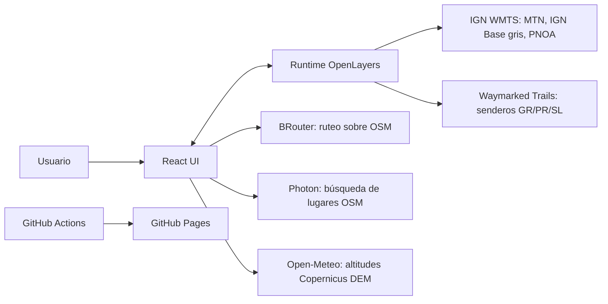

# Via Augusta – Arquitectura

Via Augusta es un fork de [Via Helvetica](https://github.com/egofree71/via-helvetica)
adaptado a España. Conserva su arquitectura (React para el estado de la UI,
OpenLayers para el runtime imperativo del mapa, historial inmutable de rutas)
y reemplaza los proveedores suizos por servicios españoles o abiertos.

## Contexto del sistema

| Proveedor | Uso | Si falla |
|---|---|---|
| IGN WMTS (`ign.es/wmts`) | Mapas de fondo (GoogleMapsCompatible) | El fallo inicial bloquea; teselas aisladas no |
| Waymarked Trails | Capa de senderos | Solo desaparece la capa |
| BRouter (`brouter.de`) | Tramos que siguen caminos, snap del primer punto | Mensaje de error; se puede pasar a tramos rectos |
| Photon (`photon.komoot.io`) | Búsqueda de lugares, filtrada por `osm_tag` | Búsqueda no disponible; las coordenadas siguen funcionando localmente |
| Open-Meteo | Perfil, desnivel, tiempo MIDE, altura de un punto | Distancia disponible, métricas de altitud no |

Todos admiten CORS, así que la app sigue siendo 100 % estática. Los endpoints se
pueden sustituir por instancias propias con `VITE_BROUTER_URL`,
`VITE_PHOTON_URL` y `VITE_ELEVATION_URL`.

## Sistemas de coordenadas

- **Mapa y geometría editable: EPSG:3857.** Todas las capas IGN y el overlay se
  publican en esa malla, así que no hay reproyección de teselas.
- **Distancias siempre geodésicas** (`ol/sphere`), porque 3857 no es métrico a
  latitudes españolas (~×1,3). Esto incluye el límite de 20 km por tramo
  (`src/routing/routeSectionLimit.ts`) y el remuestreo del perfil.
- **WGS 84** en los bordes: geolocalización, búsqueda, BRouter, Open-Meteo y GPX.
- **UTM ETRS89 (EPSG:25828–25831)** para mostrar e introducir coordenadas
  (`src/map/projection.ts`, `src/search/coordinateSearch.ts`). Sin huso
  explícito se asume el 30, o el 28 si la northing es de Canarias.

## Módulos principales

| Área | Módulos |
|---|---|
| Composición | `src/App.tsx` |
| Runtime del mapa | `src/map/mapRuntime.ts`, `src/map/config.ts`, `src/map/projection.ts` |
| Ruta editable | `src/map/useEditableRoute.ts`, `src/map/routeState.ts`, `src/routing/routeEditing.ts` |
| Ruteo | `src/routing/brouterRouting.ts` (contrato `snap` / `route`; "sin camino" → `null` → tramo recto) |
| Métricas | `src/metrics/routeMetrics.ts`, `src/elevation/openMeteoElevation.ts` |
| Búsqueda | `src/search/locationSearch.ts`, `src/search/coordinateSearch.ts` |
| GPX | `src/import/gpx.ts`, `src/export/gpx.ts` |
| i18n / SEO | `src/i18n/`, `scripts/generate-localized-pages.mjs`, `scripts/templates/` |

## Perfil y tiempo de marcha

1. La ruta se remuestrea localmente cada ~20 m (máximo 1.000 muestras), por distancia geodésica.
2. Las altitudes se piden a Open-Meteo en lotes de 100, con 3 peticiones en paralelo.
3. Una media móvil (±2 muestras) suaviza los escalones del DEM de 90 m.
4. El tiempo sigue el método MIDE: 4 km/h en horizontal, 400 m/h de subida y
   600 m/h de bajada. En tramos de ~1 km se suma el mayor de los dos tiempos
   más la mitad del menor.

## Despliegue

`scripts/generate-localized-pages.mjs` genera `index.html` (x-default, en español),
`es/`, `en/`, las páginas de historial, `sitemap.xml` y `robots.txt` a partir de
`VITE_BASE_PATH` y `VITE_SITE_URL`. El workflow de GitHub Actions obtiene ambos
valores de `actions/configure-pages`, así que funciona igual con un dominio propio
o bajo `https://<usuario>.github.io/<repo>/`.
