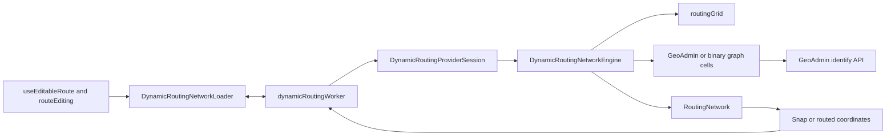

# Via Helvetica Browser Routing

## Executive summary

Via Helvetica calculates experimental hiking routes entirely in the browser.
A dedicated module Worker loads bounded official swissTLM3D data around
user-selected positions, caches raw cells, builds a regional walkable graph,
snaps waypoints, and runs A*. The main React/OpenLayers thread exchanges only
plain coordinate arrays, route results, cancellation messages, and serialized
errors with the Worker.

The required graph comes from the official
`ch.swisstopo.swisstlm3d-strassen` road-and-path layer. The official
`ch.swisstopo.swisstlm3d-wanderwege` layer is optional enrichment used to lower
the cost of matching graph edges. If that optional layer cannot be obtained, the
Worker continues in roads-only mode and reports one non-blocking session notice.

A precomputed provider can instead load versioned 2.4 km binary graph cells
generated from the official swissTLM3D GeoPackage. The offline pipeline supports
the complete Swiss road-and-path dataset with disk-backed generation, while all
large local inputs and outputs live outside the repository. Setting
`VITE_ROUTING_DATA_BASE_URL` activates a remote root in either development or
production. The Worker makes at most three binary-provider attempts, separated
by cancellable 300 ms and 1,000 ms delays. Expected coverage misses use the
independent GeoAdmin engine only for that operation, while persistent delivery
or integrity failures switch the complete session. Binary and GeoAdmin cells are
never mixed in one graph. Production without the explicit environment variable
remains on GeoAdmin.

This subsystem is intentionally bounded and experimental. It does not operate
a project-owned backend, and the new national static dataset still requires
cross-region and remote-browser validation before it can replace the GeoAdmin
fallback as the production default. Users can disable snapping or rely on a
straight fallback section when local coverage or graph connectivity is
insufficient.

## 1. Goals and non-goals

### 1.1 Goals

The routing subsystem should:

- keep route calculation available without a project-owned server;
- load only the geographic region needed for the current operation;
- preserve map responsiveness by running provider loading and graph work in a
  Worker;
- snap waypoints to nearby walkable roads and paths;
- prefer official hiking-trail sections when optional enrichment is available;
- avoid connecting vertically separated roads at bridges and tunnels when Z
  values are present;
- cache completed cells and recent corridor graphs for the browser session;
- distinguish normal missing coverage from provider or parsing errors;
- abort superseded work;
- degrade optional enrichment before required graph connectivity.

### 1.2 Non-goals

The current implementation does not provide:

- a production-validated national graph release;
- a guaranteed production-grade national route service;
- live navigation or continuous user tracking;
- automatic avoidance of visible closure or military information layers;
- persistent routing caches between browser sessions;
- turn-by-turn instructions;
- route alternatives or multi-criteria profiles exposed to users;
- a general-purpose transport router.

## 2. Subsystem boundaries



### 2.1 Main-thread facade

`src/routing/dynamicRoutingNetwork.ts` provides the
`DynamicRoutingNetworkLoader` facade used by editable-route logic. It owns:

- lazy Worker creation;
- typed request identifiers;
- request/response correlation;
- `AbortSignal` to Worker-cancellation bridging;
- reconstruction of typed errors;
- retention and replay of non-blocking session notices;
- Worker restart after an unexpected failure;
- disposal of pending operations with the editable-route lifecycle.

It owns no routing cells, graph, or OpenLayers state.

### 2.2 Worker entry

`src/routing/dynamicRoutingWorker.ts` owns a
`DynamicRoutingProviderSession` containing independent binary and GeoAdmin
`DynamicRoutingNetworkEngine` instances when remote or local binary data is
enabled. It maps protocol operations to the active provider, creates a
per-request abort controller, serializes errors, and posts independent session
notices. A permanent provider transition disposes binary requests and caches
before repeating the complete operation on GeoAdmin.

Synchronous graph construction may finish after a late cancellation, but it no
longer blocks the map thread and its obsolete response is ignored by the
request-correlation layer.

### 2.3 Worker-owned engine

`src/routing/dynamicRoutingEngine.ts` owns:

- completed GeoAdmin geometry or binary graph cell cache;
- reusable in-flight cell requests;
- exact-cell-signature graph LRU cache;
- cell loading concurrency;
- certified metric-envelope attempts for binary cells;
- unchanged narrow and widened radius corridors for GeoAdmin and final safety fallback;
- source-feature merging and compilation for GeoAdmin cells;
- typed-array CSR assembly when binary graph cells are used;
- snapping and A* invocation;
- the session-wide hiking-enrichment availability flag.

### 2.4 Graph compilation and runtime

`src/routing/precomputedRoutingGraph.ts` is a pure shared compiler. It applies
3D node quantization, pedestrian exclusions, road-cost policy, optional hiking
matching, and duplicate-segment resolution. Live GeoAdmin routing calls it
inside the Worker. The offline binary generator transpiles and executes the same
source file against generated geometry inputs.

`src/routing/networkRouter.ts` joins one or more compiled JSON fragments,
creates object-based adjacency lists and the snapping index required by the exact
requested corridor, and runs A*. `src/routing/binaryRoutingNetwork.ts` implements
the same snapping and A* contract over global integer IDs, fixed-point
coordinates, CSR adjacency, and typed arrays. The binary graph also exposes an
optional `routeAttempt()` diagnostic that reports whether A* expanded a node
outside the cells whose complete graph data was loaded. The binary corridor
policy consumes this diagnostic to accept a smaller metric envelope only when
no omitted neighbouring data can improve the result. GeoAdmin continues to use
the object graph and the established radius-based policy. This split keeps route
search in the browser while allowing the binary experiment to remove string-key
and per-node object reconstruction.

### 2.5 Route-edit integration

`src/routing/routeEditing.ts` translates engine outcomes into immutable route
sections. It rebuilds only sections affected by waypoint addition, movement,
insertion, deletion, or loop changes. It decides when a normal no-path result
may become a straight fallback and when an error must leave the route unchanged.

## 3. Data sources and trust model

### 3.1 Required road-and-path data

The official GeoAdmin layer
`ch.swisstopo.swisstlm3d-strassen` supplies the geometries used to build graph
connectivity. Missing or truncated required roads can break routes, so unresolved
road truncation remains a hard error.

### 3.2 Optional hiking enrichment

The official layer `ch.swisstopo.swisstlm3d-wanderwege` supplies optional
hiking geometry. It does not become a second graph. Instead, graph road segments
that match official hiking geometry receive a lower routing cost.

The dataset and portrayal are official. However, the GeoAdmin layer table does
not advertise the same feature-tooltip behaviour as the road layer, so vector
retrieval through `identify` is treated as non-guaranteed enrichment.

### 3.3 Preprocessed Swiss dataset

Both offline stages originate from the official swissTLM3D LV95/LN02
GeoPackage. The road table already carries the `wanderwege` classification used
by the current cost model, so the separate hiking GeoPackage is not required for
this build.

Source, intermediate geometry, SQLite work, and binary release files live
outside the repository. Their machine-local paths are defined in the
Git-ignored `routing-data.config.local.json`; neither Vite nor the browser reads
that file. The complete import, generation, verification, migration, script
inventory, and R2 publication workflow is documented in
[ROUTING_DATA_PIPELINE.md](ROUTING_DATA_PIPELINE.md).

The generated release contains:

```text
manifest.json
integrity.json
cells/{column}_{row}.bin
cells/{column}_{row}.bin.br
```

Every cell stores columnar arrays for node IDs, centimetre-quantized LV95 X/Y,
decimetre-quantized Z, edge IDs, endpoint IDs, 0.0001-unit fixed-point costs, and
a hiking bit. Format version 3 requires strictly increasing node and edge IDs,
includes a CRC32 over the payload, and repeats the generator revision plus a
32-byte SHA-256 `datasetBuildId` from the manifest. This rejects mixed annual or
partial builds even when their global record counts happen to match.

The runtime parser verifies the dataset build identity, CRC32, strict global-ID
ordering, coordinate and elevation bounds, endpoint membership, and plausible
cost/length ratios before a cell can enter the cache. Coordinate validation uses
the declared dataset extent together with a cell-local allowance because source
features remain complete rather than being clipped at cell boundaries. Cost
validation includes the bounded endpoint displacement introduced when the
national merge selects deterministic representatives inside shared 0.5 m node
identity buckets, plus fixed-point rounding. This avoids rejecting valid short
edges without weakening the pedestrian cost-model bounds.

Corridor assembly k-way merges the sorted columns, so the national global-ID
range does not require sparse JavaScript Maps per graph. `integrity.json` is an
offline publication contract and is not loaded by the browser.

## 4. Spatial loading model

### 4.1 Native coordinates

All routing requests, cells, graph nodes, snapping distances, and corridor
calculations use LV95 (`EPSG:2056`) metres.

### 4.2 Regular routing cells

`src/routing/routingGrid.ts` divides LV95 space into regular cells.

| Constant | Value | Purpose |
|---|---:|---|
| Maximum direct network section | 15,000 m | Requires intermediate waypoints when one snapped section would leave the intended hiking corridor ambiguous |
| Cell size | 2,400 m × 2,400 m | Stable unit for loading, caching, and corridor signatures |
| Maximum snap distance | 260 m | Limits attachment to unrelated roads |
| Binary metric-envelope steps | 400 m, 700 m, 1,100 m, 1,600 m, 2,400 m | Uses typical-case halos with intermediate cache-stable steps; certification makes a small first attempt safe |
| Binary envelope growth | 0.6 m per metre of direct distance | Selects a typical-case initial step; over-fetching is costlier than a certified retry |
| GeoAdmin initial corridor radius | 1 cell | Preserves the crossed-cell line walk plus one neighbour on every side |
| Legacy safety radius | 2 cells | Final binary fallback and normal GeoAdmin retry when smaller bounded attempts are insufficient |
| Maximum cells per operation | 80 | Prevents one long section from causing excessive traffic or memory use |

Cell keys use stable integer column/row addresses. Extents are derived directly
from those indexes.

### 4.3 Main-thread section admissibility

The first waypoint remains a local snap operation and has no incoming section.
Every later network-routed section is checked on the main thread before Worker
creation or provider traffic. Its intended LV95 endpoints may be at most 15 km
apart in direct horizontal distance.

This is a product rule rather than an estimate of exact request volume. Beyond
that distance, two points do not express a hiker's intended valley, pass, or
side of a mountain clearly enough for the experimental router to choose a
meaningful corridor. The user receives the measured distance and is asked to add
an intermediate waypoint.

The same check applies to:

- endpoint addition;
- moved-waypoint incoming, outgoing, and loop-closing sections;
- both halves created by insertion;
- neighbour reconnection after deletion;
- loop closure.

Explicit straight mode is not limited because it performs no network loading
and represents geometry chosen directly by the user. Routing helpers repeat the
check immediately before the Worker facade as a defensive invariant for future
callers.

### 4.4 First-waypoint footprint

The first waypoint does not load a complete route corridor. It calculates the
closed square snapping box around the selected coordinate and loads only cells
whose extents intersect that box. This normally yields:

- one cell in the interior;
- two cells near an edge;
- four cells near a corner.

The point is then snapped against the resulting local graph. If no walkable
network exists or no segment falls within the maximum snap distance, the engine
returns `null` so the editor may place the point freely.

### 4.5 Provider-specific route footprints

For binary routing, `createSegmentEnvelopeCellKeys()` selects every cell whose
closed extent lies within a metric capsule around the direct segment. The
initial margin includes the 260 m snapping footprint at both endpoints and grows
with direct section length:

```text
wanted margin = 260 m + 0.6 × direct distance
initial step   = first of 400 m, 700 m, 1,100 m, 1,600 m, 2,400 m
                 that covers the wanted margin
```

The coefficient targets typical interactive sections rather than a pessimistic
A* exploration bound. A small envelope can be widened safely when the frontier
certificate remains inconclusive, while cells loaded unnecessarily cannot be
recovered. Distances whose wanted margin exceeds 2,400 m start at the 2,400 m
step. The discrete ladder keeps neighbouring edits on reusable graph signatures
instead of producing a unique cache key for every metre.

GeoAdmin retains the integer cell-line walk and square radius expansion. Its
feature assignment is observed but not validated through the binary manifest,
so the frontier certificate is deliberately not applied to that provider.

### 4.6 Certified widening and legacy safety fallback

A binary route operation:

1. builds or reuses the first applicable metric-envelope graph;
2. calls `routeAttempt()` to obtain a path or miss plus `frontierReached` and
   the separate `snapMiss` cause;
3. returns `null` immediately when a snap miss occurs after the envelope has
   covered both complete 260 m endpoint footprints;
4. accepts a path or connectivity miss when `frontierReached` is false;
5. otherwise repeats with the next distinct metric step while that envelope is
   strictly smaller than and fully contained in the established radius-1
   corridor;
6. when an envelope is no longer cheaper, extends outside radius 1, diagnostics
   are unavailable, or all smaller metric steps remain inconclusive, re-enters
   the complete legacy radius-1/radius-2 workflow;
7. returns exactly the legacy result after that fallback, including `null` when
   both historical attempts miss.

This footprint guard prevents the metric policy from making long sections more
expensive or loading cells that release 1.2 would never request. During local
development, each metric
candidate logs its direct distance, attempt number, margin, cell count, and
outcome in the Worker console so the ladder can be tuned from real sessions.

A GeoAdmin route operation remains unchanged: radius 1 is attempted first and
radius 2 only after a normal miss. Provider, parsing, cancellation, and
safety-limit errors are not converted into a wider normal retry unless their
owning layer handles them explicitly.

## 5. GeoAdmin request strategy

### 5.1 Identify endpoint

`src/routing/swissTlmApi.ts` calls the documented GeoAdmin
`MapServer/identify` endpoint directly in `EPSG:2056`.

One logical request normally asks for both roads and hiking geometry. This avoids
doubling provider traffic when enrichment is accepted.

### 5.2 Request tiling

Each 2.4 km routing cell is initially divided into 1.2 km request tiles. A tile
that reaches the provider result cap is subdivided recursively.

| Constant | Value | Reason |
|---|---:|---|
| Initial request tile | 1,200 m | Keeps responses bounded inside a routing cell |
| Result limit | 200 features | GeoAdmin identify response cap used as the truncation signal |
| Maximum subdivision depth | 3 | Bounds recursive request growth |
| Tile-request concurrency | 4 | Protects the provider and browser while keeping loading interactive |
| Worker cell concurrency | 2 | Bounds simultaneous cell assembly at the engine level |

Road and hiking counts are evaluated independently.

- A road result still capped at the minimum tile size is a hard error because
  missing roads may break graph connectivity.
- A hiking result still capped at the minimum tile size is accepted as partial
  enrichment because missing hiking matches affect preference, not connectivity.

Empty road cells are valid near borders, lakes, and areas outside swissTLM3D
coverage.

### 5.3 Timeout and retry

Each identify attempt has:

- a 15-second timeout;
- one internal retry for network failure, timeout, HTTP 408, 429, 502, 503, or
  504;
- a fallback delay of 400–1,000 ms with jitter;
- support for a short `Retry-After` value up to 15 seconds;
- immediate caller cancellation during fetch or retry delay.

A longer `Retry-After` is surfaced rather than shortened, because retrying too
early would create another likely failure.

Progress counts logical tiles, not internal attempts.

### 5.4 Stable feature identity

Features crossing request or cell boundaries may appear several times. Provider
IDs are used where available. A coordinate-based fallback ID uses bounded
precision when necessary. Features are deduplicated before graph construction.

## 6. Hiking-enrichment fallback

### 6.1 Combined request rejection

If GeoAdmin rejects the combined road-and-hiking layer request with a
non-retryable HTTP response, the same tile is requested again with the required
road layer only.

Network failures, timeouts, rate limiting, and transient server statuses keep
their normal retry behaviour and are not misclassified as a layer-specific
rejection.

### 6.2 Session-wide roads-only mode

The first confirmed layer-specific rejection disables new hiking requests for
the remaining lifetime of the routing Worker. Concurrent and later cells share
the same engine-owned flag. Already cached hiking geometry remains valid.

This one-way transition prevents every new waypoint from repeating a known
unsupported request.

The Worker emits one structured session notice. The main-thread facade retains
it and replays it to a later subscriber when necessary, which protects the
notice across React Strict Mode development setup/cleanup cycles.

### 6.3 Provider selection and remote-data testing

`src/routing/routingConfig.ts` resolves provider choice in this order:

1. a non-empty `VITE_ROUTING_DATA_BASE_URL` activates the remote precomputed
   binary provider in development or production;
2. without that variable, Vite development uses
   `LOCAL_ROUTING_DEVELOPMENT_CONFIG`, which defaults to GeoAdmin but remains a
   manual local binary/GeoAdmin comparison switch;
3. production without an explicit remote URL uses GeoAdmin.

The URL must point to the versioned directory containing `manifest.json`, for
example:

```text
https://pub-example.r2.dev/swisstlm3d-2026/format-v3/ch
```

Copy `.env.example` to the git-ignored `.env.local` for a local remote-data test.
The GitHub Pages workflow also forwards the optional repository variable named
`VITE_ROUTING_DATA_BASE_URL` into the Vite build. The binary loader normalizes
the root, accepts only root-relative or HTTP(S) URLs without credentials, query,
or fragment, and resolves all cell paths from validated relative manifest
templates.

With local GeoAdmin selected, setting `useHikingEnrichment` to `false` starts the
Worker in roads-only mode and emits the normal notice when the first routing
operation begins. This setting does not affect the rendered hiking map overlay.

### 6.4 Session-level binary fallback

Transient manifest or cell delivery failures receive at most three attempts.
The first retry waits 300 ms and the second waits 1,000 ms; both delays remain
immediately cancellable. Deterministic manifest and dataset-build
incompatibilities fail immediately because another download cannot make the
contract compatible. Persistent delivery failures, compatibility failures, CRC
failures, or semantic validation failures activate a one-way Worker-session
transition:

1. abandon and dispose the binary engine;
2. emit `precomputed-routing-unavailable` once;
3. repeat the complete snap or route operation with a separate GeoAdmin engine;
4. keep all later operations on GeoAdmin.

After this transition the Worker does not probe the binary provider again until
the page creates a new Worker session, normally after a reload. This avoids
repeated object-storage delays for every later waypoint during a prolonged
outage. A `RoutingCoverageError` is expected near national borders: GeoAdmin
handles only the current operation and the binary engine remains preferred
afterward. Caller cancellation and `RoutingAreaTooLargeError` also do not change
providers. If a concurrent binary operation finishes after another request has
switched the session, its result is discarded and the operation is repeated on
GeoAdmin.

### 6.5 Remote dataset publication

The precomputed routing dataset is public static data, not an authenticated API.
R2 stores only `.bin.br` objects with `Content-Encoding: br`, so Fetch returns
decoded v3 bytes before the Worker validates them. No bucket credential or write
token is exposed to the browser or repository.

Publication remains cell-first and manifest-last. The local release is fully
verified, compressed objects are uploaded and checksum-checked, publication-only
metadata is written, and the public URL is sampled for transport decoding,
headers, CORS, and raw SHA-256 agreement. Persistent publication or integrity
failures therefore remain outside the runtime graph and trigger the normal
GeoAdmin fallback only if a bad public release is explicitly configured.

The verifier requires the exact browser origin and fails rather than silently
skipping CORS validation. Cells, `integrity.json`, and `manifest.json` retain a
one-year immutable cache because the release identity is part of their URL. A
corrected release must use a new versioned root instead of overwriting published
objects.

Commands, rclone setup assumptions, retry behaviour, and the immutable release
lifecycle are documented in
[ROUTING_DATA_PIPELINE.md](ROUTING_DATA_PIPELINE.md).

## 7. Worker protocol and lifecycle

`src/routing/dynamicRoutingProtocol.ts` defines structured-clone-safe messages
for:

- snap requests;
- route requests;
- cancellation;
- successful responses;
- serialized failures;
- non-blocking session notices.

`RoutingAreaTooLargeError` is reconstructed explicitly on the main thread so
`instanceof` handling remains meaningful across the Worker boundary.

One `DynamicRoutingNetworkLoader` belongs to the editable-route hook lifecycle.
Disposal rejects pending work and terminates the Worker. A later route-editing
session may create a fresh Worker and fresh session caches.

## 8. Cache design

### 8.1 Completed raw cells

Completed cells use a least-recently-used cache with an approximate 64 MiB byte
budget. Reusing a cell avoids another provider request when nearby edits revisit
the same area, while old cells can be released on long sessions. One oversized
current cell is retained rather than immediately evicted; the estimate is a
browser-independent safeguard, not a precise heap measurement.

### 8.2 In-flight cell sharing

Concurrent consumers share a cell-owned pending request. Each route operation
retains its own cancellation signal; cancelling one consumer no longer aborts a
fetch still needed by another. The provider request is aborted only after every
consumer has left, and a later operation can retry an aborted cell cleanly.

### 8.3 Graph LRU

Graphs are cached by an exact sorted signature of their corridor cell set.

- hard limit: 2 `RoutingNetwork` instances;
- approximate retained-size budget: 128 MiB;
- a hit is promoted to most-recently-used position;
- the least-recently-used graph is evicted when either limit is exceeded;
- one oversized current graph is retained so the route operation can complete;
- raw cells use their independent LRU and may outlive or be evicted before a graph.

Exact signatures avoid reusing a graph whose geographic coverage differs from
the requested corridor. The byte estimates include conservative allowances for
JavaScript object, adjacency, and spatial-index overhead and should be checked
against real browser measurements.

### 8.4 Feature merging

Before graph construction, roads and hiking features from all contributing
cells are merged by feature ID and a deterministic full-geometry signature.
Repeated identical geometry is removed, while a provider ID reused for a
different geometry keeps both features under derived IDs rather than silently
losing one road. GeoAdmin loads also report the observed ID-conflict count and
coordinate Z coverage in the Worker console for validation.

## 9. Graph construction

### 9.1 Vertices and edges

Each pair of consecutive swissTLM3D vertices becomes a candidate network
segment. Segments shorter than the configured minimum are discarded. Clearly
non-walkable object types are excluded.

Duplicate opposite or overlapping candidate segments are normalized so the
graph does not retain a worse duplicate edge between the same node pair.

### 9.2 Node identity and 3D separation

Graph endpoints are quantized to absorb small coordinate differences returned
by adjacent provider geometries.

| Precision | Value | Purpose |
|---|---:|---|
| Horizontal node precision | 0.5 m | Merge nearly identical XY endpoints without excessive graph fragmentation |
| Vertical node precision | 2 m | Keep crossings on different heights separate when Z values are available |

Including elevation in the node key prevents a bridge and the road beneath it
from being connected merely because their XY coordinates cross.

This protection depends on available source Z values and does not guarantee
perfect topology in every bridge or tunnel case.

### 9.3 Spatial indexes

A regular 250 m spatial grid indexes:

- hiking line segments used for enrichment matching;
- routable segments used for waypoint snapping.

The index reduces repeated full-network scans during graph construction and
snap lookup. The binary graph indexes a routable segment only in the grid
buckets actually touched by its line. It does not fill the segment's complete
rectangular envelope: that would make memory usage grow with width multiplied
by height and could reject a valid long diagonal. A separate linear traversal
limit still rejects corrupt endpoints that would span an implausible part of
the national grid.

### 9.4 Road cost factors

Walkable road segments receive a multiplicative cost factor derived from
available swissTLM3D attributes such as:

- object type;
- width or road importance;
- surface;
- traffic relevance;
- access restriction;
- official hiking match.

A factor of `Infinity` excludes a non-walkable segment. Lower positive factors
make a segment more attractive to A*. The minimum configured cost factor is
`0.45`; the A* heuristic uses this lower bound to remain admissible.

The exact attribute policy belongs in `networkRouter.ts` and its tests because
it may evolve as swissTLM3D attributes are validated in more regions.

Distances and costs are horizontal in LV95. Elevation belongs to node identity
to protect bridges and tunnels, but slope does not currently change A* edge cost;
the separate elevation-profile workflow applies altitude to walking-time metrics
after an itinerary has been selected.

## 10. Hiking-segment matching

Hiking geometry is not assumed to share exact vertices with the road network.
A road segment is evaluated against nearby indexed hiking segments using:

- maximum matching distance: 8 m;
- direction compatibility with minimum cosine `0.7`;
- samples at 25%, 50%, and 75% of the road segment;
- at least two matching samples to classify the road segment as hiking
  enrichment.

Sampling several positions avoids marking a road as a hiking trail merely
because the two lines cross once. Direction checks reduce false matches between
nearby parallel or perpendicular geometries.

A missing match never removes graph connectivity; it only leaves the normal road
cost unchanged.

## 11. Snapping

### 11.1 Snap search

The graph segment index queries candidates inside the 260 m maximum distance.
Each user coordinate is projected onto candidate segments, and the closest valid
projection is selected.

The snap result contains:

- projected coordinate, including interpolated Z when available;
- distance from the user selection;
- matched network segment;
- fractional position from 0 to 1 along that segment.

### 11.2 Route endpoints on segments

A snapped route may begin or end inside a segment. The router creates candidate
costs to both segment endpoints and later reconstructs exact connector geometry
from the projected snap positions.

If both endpoints snap to the same segment, a direct same-segment path is tested
before the full graph search.

### 11.3 Normal snap miss

A snap operation returns `null` when:

- the loaded cells contain no walkable graph;
- no segment lies inside the maximum snapping distance.

This is a normal coverage result, not a provider error.

## 12. A* path calculation

### 12.1 Search state

The router uses a binary min-heap ordered by:

```text
actual accumulated cost + straight-line distance to goal × MIN_COST_FACTOR
```

Because `MIN_COST_FACTOR` is no greater than any configured edge factor, the
heuristic remains a lower bound on remaining cost and therefore admissible.

The search tracks:

- best known distance to each graph node;
- previous node for reconstruction;
- best complete destination cost discovered so far.

Queue entries whose priority cannot improve the best complete route are skipped.
Stale heap entries whose distance is worse than the stored best distance are
also ignored.

### 12.2 Loaded-cell frontier diagnostic

The typed-array binary graph can additionally return a `RouteAttempt` containing
the path, a conservative `frontierReached` flag, and a separate `snapMiss`
cause. This diagnostic is enabled only when every assembled cell came from a
manifest that guarantees complete, unclipped feature assignment and globally
shared graph identity.

During graph assembly, each local node receives one byte indicating whether its
containing 2.4 km cell was fully loaded. During A*, the frontier flag becomes
true when a node outside that set is expanded while its queue priority can still
beat the best complete route. Nodes remaining after the normal `bestCost`
cutoff do not invalidate the result because the admissible heuristic proves that
they cannot produce a cheaper path.

When snapping fails, the binary graph checks the exact covered-cell set against
both 260 m endpoint footprints. The miss is final only when every required cell
was actually loaded from the validated dataset; a missing border cell keeps the
attempt inconclusive so provider fallback remains possible. The same covered-set
check handles a graph with no walkable edges. The object-based GeoAdmin graph
continues to expose only the existing `route()` contract.

### 12.3 Destination candidates

The end snap can connect through either endpoint of its matched segment. When the
search reaches one of those graph nodes, the final connector cost is evaluated.
The best complete destination cost allows the search to stop exploring branches
that cannot produce a better route.

### 12.4 Reconstruction

The selected graph-node chain is reconstructed backwards through the previous-
node map, then converted to ordered coordinates. Reconstruction is bounded by
the assembled graph's node count, so stale or cyclic predecessor state becomes
an explicit provider error instead of an unbounded Worker loop. Exact snapped
start and end connectors are added while avoiding duplicate adjacent
coordinates.

The result contains only structured-clone-safe coordinate arrays and a network
mode indicator.

## 13. Route-edit semantics and straight fallback

### 13.1 Addition

With snapping disabled, a new section is an exact direct line.

With snapping enabled:

- the first waypoint is snapped locally when possible;
- later waypoints farther than 15 km in direct LV95 distance are rejected before
  Worker activity and require an intermediate point;
- admitted later waypoints request a routed section;
- a normal no-path result becomes a straight section;
- the global snap option remains enabled for the next operation.

### 13.2 Movement

Moving a waypoint rebuilds only its incoming and outgoing sections. In a closed
route, moving the first or last waypoint also rebuilds the closure where
required. A GPX converted for editing enters the same workflow: untouched
sections remain marked `imported`, while every section actually rebuilt by a
move becomes a normal `generated` network or straight section.

Imported-GPX conversion targets about 1 km between anchors for ordinary traces
and adapts to shorter routes so they still expose interior handles. For very long
traces the preferred anchor count may be exceeded rather than letting imported
sections approach the 15 km network-section boundary. The initial conversion is
limited to 20,000 source vertices; denser GPX files remain read-only. Because
anchors must be existing GPX vertices, a trace whose source points are themselves
more than 15 km apart is also kept read-only instead of inventing interpolation
points that would violate lossless conversion.

Anchor count and map clutter are deliberately separate concerns. Every anchor
remains in immutable route state, but broad map resolutions show only handles
that are sufficiently separated in screen space. Hidden anchors are not rendered
or waypoint-hit-tested until zoom makes them visible again. Direction arrows use
that same visible-anchor set as their avoidance coordinates.

### 13.3 Insertion

Dragging a stored section inserts one waypoint and replaces that section with
two sections. Each half independently uses the current snap mode and may
independently fall back to a straight line after a normal coverage miss. This is
also the transition point at which an imported section touched by insertion is
replaced by generated geometry.

### 13.4 Deletion

Deleting an intermediate waypoint normally reconnects its neighbours using the
current snap mode. One deliberate exception protects converted GPX geometry: if
both sections adjacent to an automatically created anchor are still imported,
their stored coordinate arrays are concatenated and the routing loader is not
called. Removing such an anchor therefore changes edit granularity without
changing the trace. If either adjacent section has already been generated, the
normal reconnection rule applies. Endpoint deletion in a closed route rebuilds
the remaining loop. Unrelated sections retain their exact stored geometry.

### 13.5 Error versus fallback

A straight fallback is allowed for normal absence of coverage or connectivity
only after a section has passed the direct-distance product rule. It is not used
to hide:

- a network section longer than 15 km;
- network transport failure;
- response parsing failure;
- unresolved required-road truncation;
- routing-area safety-limit overflow;
- unexpected Worker failure.

Those errors leave the committed route unchanged and are surfaced to the user.

## 14. Cancellation and stale results

Each main-thread operation owns an `AbortSignal`. Cancellation is forwarded to
the Worker and then to provider requests and retry delays.

Cancellation occurs when:

- route mode is left;
- a newer serialized route mutation supersedes active work;
- the application unmounts;
- the routing facade is disposed.

Completed cells remain useful when they finished before cancellation. Shared
cell requests outlive an individual cancelled consumer while another operation
still depends on them; an all-consumer cancellation removes the pending entry so
the cell can be requested again later.

Late Worker responses are correlated by request ID and ignored after the
request has been cancelled or replaced.

## 15. Failure model

| Outcome | Meaning | Editor behaviour |
|---|---|---|
| `RouteSectionTooLongError` | Intended network section exceeds 15 km direct distance | Preserve the route and request an intermediate waypoint before Worker activity |
| `null` from local snap | Empty graph or no nearby segment | Place first waypoint freely |
| `null` after certified/legacy bounded attempts | Normal missing coverage or connectivity | Store that section as straight |
| Hiking enrichment unavailable | Optional provider capability rejected | Continue roads-only and show one notice |
| Precomputed routing coverage miss | Current operation lies outside installed national cells | Try that operation with GeoAdmin while retaining the binary provider |
| Precomputed routing unavailable | Remote/local binary delivery or integrity failed after retry | Dispose binary state, repeat the complete operation on GeoAdmin, and show one notice |
| `RoutingAreaTooLargeError` | Cell safety limit exceeded | Preserve route and ask for intermediate waypoints |
| Required-road truncation | Provider cap remains after maximum subdivision | Preserve route and report error |
| Timeout or transient failure after retry | Provider unavailable | Preserve route and report error |
| Intentional cancellation | Operation replaced or editing ended | No user-visible error |
| Worker crash | Unexpected subsystem failure | Reject pending requests and recreate lazily later |

## 16. Tests

### 16.1 Pure limits and grid tests

`routeSectionLimit` protects the exact 15 km boundary and the actionable typed
error without creating a Worker. `routeEditing` tests verify that additions and
reconnections reject long network sections before calling the loader while
straight mode remains unrestricted.

`routingGrid` behaviour is tested without importing Worker or graph code:

- one/two/four-cell first-click footprints;
- corridor cell selection;
- stable LV95 extents.

### 16.2 Provider tests

`swissTlmApi` tests protect:

- request timeout;
- one-shot transient retry;
- `Retry-After` handling;
- road-only retry after combined-layer rejection;
- road versus hiking truncation semantics;
- cancellation distinction;
- response normalization, invalid-coordinate splitting, collision-safe identity,
  and measured Z diagnostics.

Live GeoAdmin requests are not used by the regression suite.

The geometry-cell provider tests additionally protect manifest compatibility,
bounded coverage, empty-cell handling, the shared runtime/generator geometry
contract, invalid-coordinate splitting, numeric attribute normalization, and
direct hiking classification. The precomputed provider tests protect its
separate manifest, v3 build identity, strictly ordered compact node and segment
tables, map-free multi-cell merging, local-index resolution, global node
identity, HTTP-decoded Brotli delivery, the three-attempt 300 ms/1,000 ms
backoff, and explicit out-of-coverage behaviour. The dataset-verifier fixtures
additionally reject key-set mismatches and
cross-cell global-node conflicts.

### 16.3 Worker-client tests

The main-thread facade tests cover:

- request correlation;
- typed error reconstruction;
- cancellation messages;
- ignored late responses;
- notice retention;
- disposal and unexpected Worker failure.

### 16.4 Engine tests

The engine uses mocked provider loaders and graph doubles to protect:

- certified binary metric-envelope acceptance and widening;
- radius-1 then radius-2 binary safety fallback after inconclusive metric attempts;
- unchanged GeoAdmin narrow-to-wider corridor retry;
- completed cell reuse;
- in-flight cell reuse;
- cleanup and retry after an aborted cell request;
- partial corridors at bounded-provider edges;
- true least-recently-used and byte-budget graph eviction;
- cache and area limits;
- session-wide roads-only transition;
- provider-error propagation;
- normal straight-fallback signalling.

### 16.5 Graph tests

`networkRouter` and shared-compiler tests cover structured-clone-safe results,
shared nodes across fragments, duplicate boundary geometry, geometry/precomputed
route parity, removal of excluded-road orphan nodes, 2D/3D identity separation,
the lower-bound invariant required by the A* heuristic, and bounded
predecessor reconstruction for both graph implementations.

### 16.6 Manual geographic validation

Automated tests cannot prove the quality of real swissTLM3D topology. Manual
validation should include contrasting regions:

- dense urban street networks;
- mountain paths and switchbacks;
- parallel hiking and road geometries;
- bridges, tunnels, and vertically separated crossings;
- lakes and empty cells;
- border areas;
- long detours that challenge corridor width;
- regions where optional hiking identify is rejected or incomplete.

Results should guide tuning before considering a national preprocessed graph or
backend.

## 17. Performance limits and trade-offs

The current values intentionally favour bounded public-provider use and browser
responsiveness over exhaustive national routing.

Trade-offs include:

- larger cells improve graph continuity but increase response size and graph
  construction cost;
- wider corridors find larger detours but increase provider traffic and memory;
- larger snap distance makes selection easier but risks unrelated roads;
- more request concurrency reduces latency but increases provider load;
- larger graph caches improve local editing but retain more memory;
- aggressive hiking matching improves trail preference but increases false
  positives;
- stronger road penalties influence quality but can produce surprising detours.

Tuning must be validated geographically rather than optimized against one
example route.

## 18. Possible evolution

### 18.1 Near-term validation

Further work should focus on evidence:

- add topology fixtures for real bridge, tunnel, and junction cases;
- compare routes in urban, rural, alpine, and border regions;
- measure provider request volume and latency;
- inspect roads-only versus enriched route quality;
- document reproducible problematic corridors.

### 18.2 National preprocessed routing data

The preprocessing pipeline has one offline source stage and one browser runtime
representation:

```text
official GeoPackage
        ↓
normalized geometry cells (offline build input and validation oracle)
        ↓ shared TypeScript graph compiler + disk-backed global ID index
precomputed binary graph cells
        ↓
versioned static object storage
        ↓
Worker loads corridor cells on demand
```

The earlier 102-cell Geneva dataset remains historical validation evidence: it
demonstrated exact graph parity, preserved 3D separation, large reductions in
assembly time and retained memory, and reliable remote fallback behaviour. The
national generator generalizes that format without loading the complete Swiss
graph into JavaScript memory.

Before a national release becomes the production primary, validation must still
cover contrasting urban, rural, alpine, tunnel, border, and low-connectivity
regions; cold and warm remote transfer; desktop and mobile browsers; cell-size
outliers; Worker memory; cache reuse; and deliberate missing-object fallback.

Generated routing data remains outside the repository. Development and
production load the versioned object-storage root, while local source,
intermediate, and release paths are reserved for the offline maintenance
pipeline described in [ROUTING_DATA_PIPELINE.md](ROUTING_DATA_PIPELINE.md).

### 18.3 Hierarchical graph or backend

A hierarchical preprocessed graph or backend becomes reasonable only when
measured national usage or routing quality shows that bounded browser cell
loading cannot meet the product goal. Such a change would require decisions about:

- data update cadence;
- hosting and bandwidth cost;
- graph partitioning;
- API design and abuse protection;
- monitoring and operational ownership;
- privacy and route-request retention;
- offline or static alternatives.

The existing `DynamicRoutingNetworkLoader` boundary should make future routing
implementations replaceable without coupling React components to graph details.

## 19. Routing dataset release lifecycle

A routing release is immutable and identified by its source-data and binary
format path, for example:

```text
swisstlm3d-2026/format-v3/ch/
```

Global IDs are regenerated as one complete release; the per-cell
`datasetBuildId` prevents accidental mixing. The previous remote release remains
available during validation and rollback. A changed source edition, binary
format, or cost model receives a new path, and published objects are never
overwritten in place.

The operational checklist for source import, local comparison, R2 publication,
public verification, regional testing, and promotion through
`VITE_ROUTING_DATA_BASE_URL` lives in
[ROUTING_DATA_PIPELINE.md](ROUTING_DATA_PIPELINE.md).

## 20. Maintenance rules

Update this document when any of the following changes:

- routing provider or layer identifiers;
- direct network-section distance policy;
- cell, corridor, subdivision, timeout, retry, or concurrency policy;
- Worker protocol;
- graph-node identity or walkability rules;
- road cost or hiking-match policy;
- snap semantics;
- cache limits or eviction policy;
- distinction between fallback and error;
- geographic validation scope;
- decision to introduce a backend or change the runtime preprocessed-data contract.

Keep tuning constants documented in code with their unit and trade-off. Keep
algorithmic safeguards such as A*, heaps, subdivision, caching, and stale-result
handling explained near the implementation. This document describes the runtime subsystem design; code comments remain the
closest source for exact formulas. Update
[ROUTING_DATA_PIPELINE.md](ROUTING_DATA_PIPELINE.md) for offline import,
generation, verification, and publication changes.
